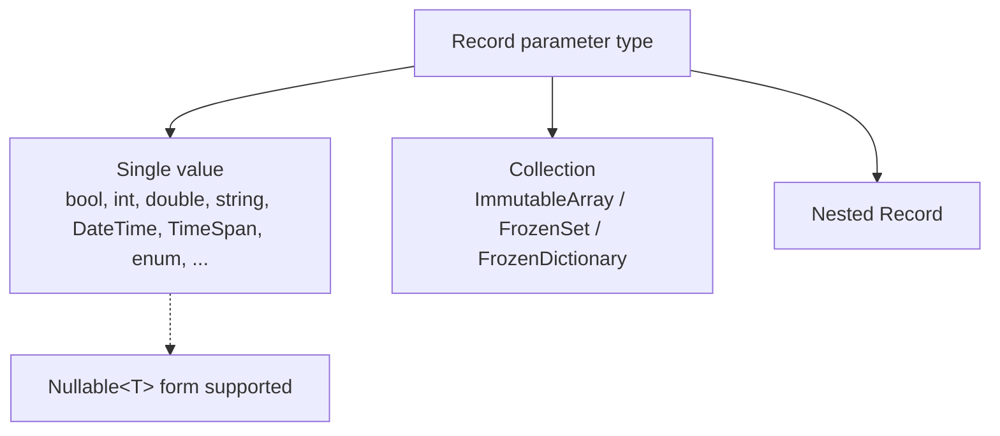

# 5.1 Supported Types (Schemata)

Sdp statically analyzes the parameter types of a Record and checks whether each type can be represented as a CSV cell value. This chapter summarizes **which types are allowed**, **which Attributes can be applied to each type**, and **which Attributes are required**.

A detailed description of each Attribute is deferred to [5.2 Attribute Catalog](./02-attributes.md); here we cover them only from the Schemata perspective. Clicking an Attribute name jumps to the corresponding entry.

## Table of Contents

Listed in the order they appear in the document.

- [At a Glance](#at-a-glance)
- Single values
  - [bool](#bool), [bool?](#bool-1)
  - [byte](#byte), [byte?](#byte-1)
  - [sbyte](#sbyte), [sbyte?](#sbyte-1)
  - [char](#char), [char?](#char-1)
  - [short](#short), [short?](#short-1)
  - [ushort](#ushort), [ushort?](#ushort-1)
  - [int](#int), [int?](#int-1)
  - [uint](#uint), [uint?](#uint-1)
  - [long](#long), [long?](#long-1)
  - [ulong](#ulong), [ulong?](#ulong-1)
  - [float](#float), [float?](#float-1)
  - [double](#double), [double?](#double-1)
  - [decimal](#decimal), [decimal?](#decimal-1)
  - [string](#string), [string?](#string-1)
  - [DateTime](#datetime), [DateTime?](#datetime-1)
  - [TimeSpan](#timespan), [TimeSpan?](#timespan-1)
  - [enum](#enum), [enum?](#enum-1)
- Collections
  - [Basic Array / Set](#basic-array--set)
  - [Single-Column Collection](#single-column-collection)
  - [Record Array / Set](#record-array--set)
  - [Map (FrozenDictionary)](#map-frozendictionary)
  - [Constraints on the Collection Itself](#constraints-on-the-collection-itself)
- [Nested Record](#nested-record)

</br></br></br>

## At a Glance

The types Sdp accepts fall into three categories.



Each entry is organized in the following format.

- **Parsing**: how the CSV cell value is read in
- **Required Attributes**: Attributes that must be present on the type
- **Available Attributes**: Attributes that can be meaningfully applied to the type (those already listed as required are not repeated)

`[ColumnName]`, `[Ignore]`, `[Key]`, `[ForeignKey]`, and `[SwitchForeignKey]` can be applied to any single-value type as long as the position is appropriate, so they are not listed separately under each entry's "Available Attributes". See [5.2](./02-attributes.md) for detailed specifications and usage examples.

> **Note on the parsing stage** — The "Parsing" notation for the entries below is based on the extraction stage (where `ExcelColumnExtractor` validates cell values against each column's schema). The runtime (`Sdp.Csv.CsvRecordMapper`) converts the strings of a validated CSV as follows.
> - `enum` — parses the member name (or an integer string) with `Enum.Parse` (case-sensitive). If not a `[Key]`, only values defined by `Enum.IsDefined` pass.
> - `DateTime` / `TimeSpan` — calls `ParseExact` with the format from `[DateTimeFormat]` / `[TimeSpanFormat]`.
> - `string` — uses the cell value as-is (no separate conversion).
> - Other single values — a single `Convert.ChangeType(value, type, InvariantCulture)` call.
>
> If the converted value carries [`[Range]`](./02-attributes.md#attr-range), [`[RegularExpression]`](./02-attributes.md#attr-regularexpression), or [`[CountRange]`](./02-attributes.md#attr-countrange), the runtime also re-checks the value with the same rules as the extraction stage.
>
> However, Primary Key duplication and Record/Attribute declaration consistency are checked only at the extraction stage (including declaration checks). Feeding a CSV that has not passed the extraction stage directly into the runtime skips these checks, so a healthy pipeline always promotes only extractor-processed CSVs to production.

---

</br></br></br>

## Single Values

### `bool`

- Parsing: `bool.TryParse` (case-insensitive)
- Required Attributes: none
- Available Attributes: —

</br>

### `bool?`

- Parsing: `null` if the cell value equals [`[NullString]`](./02-attributes.md#attr-nullstring), otherwise `bool.TryParse`
- Required Attributes: [`[NullString]`](./02-attributes.md#attr-nullstring)
- Available Attributes: —

</br>

### `byte`

- Parsing: `byte.TryParse` (InvariantCulture)
- Required Attributes: none
- Available Attributes: [`[Range]`](./02-attributes.md#attr-range)

</br>

### `byte?`

- Parsing: `null` if the cell value equals [`[NullString]`](./02-attributes.md#attr-nullstring), otherwise `byte.TryParse`
- Required Attributes: [`[NullString]`](./02-attributes.md#attr-nullstring)
- Available Attributes: [`[Range]`](./02-attributes.md#attr-range)

</br>

### `sbyte`

- Parsing: `sbyte.TryParse` (InvariantCulture)
- Required Attributes: none
- Available Attributes: [`[Range]`](./02-attributes.md#attr-range)

</br>

### `sbyte?`

- Parsing: `null` if the cell value equals [`[NullString]`](./02-attributes.md#attr-nullstring), otherwise `sbyte.TryParse`
- Required Attributes: [`[NullString]`](./02-attributes.md#attr-nullstring)
- Available Attributes: [`[Range]`](./02-attributes.md#attr-range)

</br>

### `char`

- Parsing: a single character
- Required Attributes: none
- Available Attributes: [`[Range]`](./02-attributes.md#attr-range)

</br>

### `char?`

- Parsing: `null` if the cell value equals [`[NullString]`](./02-attributes.md#attr-nullstring), otherwise a single character
- Required Attributes: [`[NullString]`](./02-attributes.md#attr-nullstring)
- Available Attributes: [`[Range]`](./02-attributes.md#attr-range)

</br>

### `short`

- Parsing: `short.TryParse` (InvariantCulture)
- Required Attributes: none
- Available Attributes: [`[Range]`](./02-attributes.md#attr-range)

</br>

### `short?`

- Parsing: `null` if the cell value equals [`[NullString]`](./02-attributes.md#attr-nullstring), otherwise `short.TryParse`
- Required Attributes: [`[NullString]`](./02-attributes.md#attr-nullstring)
- Available Attributes: [`[Range]`](./02-attributes.md#attr-range)

</br>

### `ushort`

- Parsing: `ushort.TryParse` (InvariantCulture)
- Required Attributes: none
- Available Attributes: [`[Range]`](./02-attributes.md#attr-range)

</br>

### `ushort?`

- Parsing: `null` if the cell value equals [`[NullString]`](./02-attributes.md#attr-nullstring), otherwise `ushort.TryParse`
- Required Attributes: [`[NullString]`](./02-attributes.md#attr-nullstring)
- Available Attributes: [`[Range]`](./02-attributes.md#attr-range)

</br>

### `int`

- Parsing: `int.TryParse` (InvariantCulture)
- Required Attributes: none
- Available Attributes: [`[Range]`](./02-attributes.md#attr-range)

</br>

### `int?`

- Parsing: `null` if the cell value equals [`[NullString]`](./02-attributes.md#attr-nullstring), otherwise `int.TryParse`
- Required Attributes: [`[NullString]`](./02-attributes.md#attr-nullstring)
- Available Attributes: [`[Range]`](./02-attributes.md#attr-range)

</br>

### `uint`

- Parsing: `uint.TryParse` (InvariantCulture)
- Required Attributes: none
- Available Attributes: [`[Range]`](./02-attributes.md#attr-range)

</br>

### `uint?`

- Parsing: `null` if the cell value equals [`[NullString]`](./02-attributes.md#attr-nullstring), otherwise `uint.TryParse`
- Required Attributes: [`[NullString]`](./02-attributes.md#attr-nullstring)
- Available Attributes: [`[Range]`](./02-attributes.md#attr-range)

</br>

### `long`

- Parsing: `long.TryParse` (InvariantCulture)
- Required Attributes: none
- Available Attributes: [`[Range]`](./02-attributes.md#attr-range)

</br>

### `long?`

- Parsing: `null` if the cell value equals [`[NullString]`](./02-attributes.md#attr-nullstring), otherwise `long.TryParse`
- Required Attributes: [`[NullString]`](./02-attributes.md#attr-nullstring)
- Available Attributes: [`[Range]`](./02-attributes.md#attr-range)

</br>

### `ulong`

- Parsing: `ulong.TryParse` (InvariantCulture)
- Required Attributes: none
- Available Attributes: [`[Range]`](./02-attributes.md#attr-range)

</br>

### `ulong?`

- Parsing: `null` if the cell value equals [`[NullString]`](./02-attributes.md#attr-nullstring), otherwise `ulong.TryParse`
- Required Attributes: [`[NullString]`](./02-attributes.md#attr-nullstring)
- Available Attributes: [`[Range]`](./02-attributes.md#attr-range)

</br>

### `float`

- Parsing: `float.TryParse` (InvariantCulture)
- Required Attributes: none
- Available Attributes: [`[Range]`](./02-attributes.md#attr-range)

</br>

### `float?`

- Parsing: `null` if the cell value equals [`[NullString]`](./02-attributes.md#attr-nullstring), otherwise `float.TryParse`
- Required Attributes: [`[NullString]`](./02-attributes.md#attr-nullstring)
- Available Attributes: [`[Range]`](./02-attributes.md#attr-range)

</br>

### `double`

- Parsing: `double.TryParse` (InvariantCulture)
- Required Attributes: none
- Available Attributes: [`[Range]`](./02-attributes.md#attr-range)

</br>

### `double?`

- Parsing: `null` if the cell value equals [`[NullString]`](./02-attributes.md#attr-nullstring), otherwise `double.TryParse`
- Required Attributes: [`[NullString]`](./02-attributes.md#attr-nullstring)
- Available Attributes: [`[Range]`](./02-attributes.md#attr-range)

</br>

### `decimal`

- Parsing: `decimal.TryParse` (InvariantCulture)
- Required Attributes: none
- Available Attributes: [`[Range]`](./02-attributes.md#attr-range)

</br>

### `decimal?`

- Parsing: `null` if the cell value equals [`[NullString]`](./02-attributes.md#attr-nullstring), otherwise `decimal.TryParse`
- Required Attributes: [`[NullString]`](./02-attributes.md#attr-nullstring)
- Available Attributes: [`[Range]`](./02-attributes.md#attr-range)

</br>

### `string`

- Parsing: uses the cell value directly as a string
- Required Attributes: none
- Available Attributes: [`[RegularExpression]`](./02-attributes.md#attr-regularexpression), [`[Range]`](./02-attributes.md#attr-range) (ordinal comparison — `CompareOrdinal`, culture-independent)

</br>

### `string?`

- Parsing: `null` if the cell value equals [`[NullString]`](./02-attributes.md#attr-nullstring), otherwise the string as-is
- Required Attributes: [`[NullString]`](./02-attributes.md#attr-nullstring)
- Available Attributes: [`[RegularExpression]`](./02-attributes.md#attr-regularexpression), [`[Range]`](./02-attributes.md#attr-range) (ordinal comparison — `CompareOrdinal`, culture-independent)

</br>

### `DateTime`

- Parsing: `DateTime.TryParseExact(cell, format, InvariantCulture)`
- Required Attributes: [`[DateTimeFormat]`](./02-attributes.md#attr-datetimeformat)
- Available Attributes: [`[Range]`](./02-attributes.md#attr-range)

</br>

### `DateTime?`

- Parsing: `null` if the cell value equals [`[NullString]`](./02-attributes.md#attr-nullstring), otherwise `DateTime.TryParseExact`
- Required Attributes: [`[DateTimeFormat]`](./02-attributes.md#attr-datetimeformat), [`[NullString]`](./02-attributes.md#attr-nullstring)
- Available Attributes: [`[Range]`](./02-attributes.md#attr-range)

</br>

### `TimeSpan`

- Parsing: `TimeSpan.TryParseExact(cell, format, InvariantCulture)`
- Required Attributes: [`[TimeSpanFormat]`](./02-attributes.md#attr-timespanformat)
- Available Attributes: [`[Range]`](./02-attributes.md#attr-range)

</br>

### `TimeSpan?`

- Parsing: `null` if the cell value equals [`[NullString]`](./02-attributes.md#attr-nullstring), otherwise `TimeSpan.TryParseExact`
- Required Attributes: [`[TimeSpanFormat]`](./02-attributes.md#attr-timespanformat), [`[NullString]`](./02-attributes.md#attr-nullstring)
- Available Attributes: [`[Range]`](./02-attributes.md#attr-range)

</br>

### `enum`

- Parsing: matches the cell value against an enum member name (case-sensitive). Names not defined are rejected at the extraction stage. Because the runtime calls `Enum.Parse`, it also accepts integer strings (e.g. `"1"`), but if not a `[Key]`, only values defined are passed through by the `Enum.IsDefined` check.
- Required Attributes: none
- Available Attributes: [`[Range]`](./02-attributes.md#attr-range) (compares the underlying integer)
- Note: When used together with [`[Key]`](./02-attributes.md#attr-key), the `Enum.IsDefined` check is skipped, making it usable as an ID code space (→ [5.3 Type Branding Pattern](./03-type-branding.md)).

</br>

### `enum?`

- Parsing: `null` if the cell value equals [`[NullString]`](./02-attributes.md#attr-nullstring), otherwise matched against an enum member name
- Required Attributes: [`[NullString]`](./02-attributes.md#attr-nullstring)
- Available Attributes: [`[Range]`](./02-attributes.md#attr-range) (compares the underlying integer)

---

</br></br></br>

## Collections

Three collection types are supported.

|Collection form|Fixed-size marker|
|-|-|
|`ImmutableArray<T>`|[`[Length(n)]`](./02-attributes.md#attr-length)|
|`FrozenSet<T>`|[`[Length(n)]`](./02-attributes.md#attr-length)|
|`FrozenDictionary<K, V>`|[`[Length(n)]`](./02-attributes.md#attr-length)|

Only when the elements of `ImmutableArray<T>` and `FrozenSet<T>` are primitive single values can the **single-column mode** ([`[SingleColumnCollection]`](./02-attributes.md#attr-singlecolumncollection)) additionally be used. If a constraint on the number of split elements is needed, apply [`[CountRange]`](./02-attributes.md#attr-countrange) alongside it (optional).

Collections whose elements are nullable (`ImmutableArray<int?>`, `FrozenSet<DateTime?>`, `FrozenDictionary<int, string?>`, etc.) require [`[NullString]`](./02-attributes.md#attr-nullstring) on the collection parameter. This holds regardless of which mode (Length / SingleColumnCollection) is used.

### Basic Array / Set

This is the case where the element type `T` is a single value such as `bool`, `int`, `string`, `DateTime`, or an enum. **Multi-column form** — fixed size via `[Length(n)]`. The header expands to `Col[0]`, `Col[1]`, ... `Col[n-1]`.

```csharp
[StaticDataRecord("GameItems", "Items")]
public sealed record ItemRecord(
    int Id,
    string Name,
    [Length(3)] ImmutableArray<string> Tags);
```

Header emitted by the standard header generator (tab-separated, aligned for readability):

```
Id    Name    Tags[0]    Tags[1]    Tags[2]
```

The Excel sheet is filled in as follows.

|       | **A** | **B**  | **C**     | **D**         | **E**     |
|-------|-------|--------|-----------|---------------|-----------|
| **1** | Id    | Name   | Tags[0]   | Tags[1]       | Tags[2]   |
| **2** | 1     | Potion | heal      | consumable    | small     |
| **3** | 2     | Sword  | melee     | iron          | starter   |

If the elements are `DateTime` / `TimeSpan`, the collection parameter requires [`[DateTimeFormat]`](./02-attributes.md#attr-datetimeformat) / [`[TimeSpanFormat]`](./02-attributes.md#attr-timespanformat) respectively.

```csharp
[StaticDataRecord("Events", "Schedules")]
public sealed record ScheduleRecord(
    int Id,
    string Title,
    [DateTimeFormat("yyyy-MM-dd")]
    [Length(2)] ImmutableArray<DateTime> Period);
```

Standard header:

```
Id    Title    Period[0]    Period[1]
```

### Single-Column Collection

When the elements of `ImmutableArray<T>` / `FrozenSet<T>` are primitive single values, this is the mode that packs them into a single cell using a delimiter. It is marked with `[SingleColumnCollection(",")]`. If a constraint on the number of split elements is needed, apply [`[CountRange(min, max)]`](./02-attributes.md#attr-countrange) alongside it (optional).

```csharp
[StaticDataRecord("GameItems", "Items")]
public sealed record ItemRecord(
    int Id,
    string Name,
    [SingleColumnCollection(",")][CountRange(1, 5)] ImmutableArray<string> Tags);
```

Standard header:

```
Id    Name    Tags
```

Excel sheet:

|       | **A** | **B**  | **C**                  |
|-------|-------|--------|------------------------|
| **1** | Id    | Name   | Tags                   |
| **2** | 1     | Potion | heal,consumable,small  |
| **3** | 2     | Sword  | melee,iron             |

This mode and `[Length]` cannot be used together (you must choose one or the other). It does not apply to collections whose elements are Records, nor to Maps (`FrozenDictionary`).

### Record Array / Set

This is the case where the elements are another Record. **Only `[Length(n)]` is possible.** The header expands to `Col[i].Field1`, `Col[i].Field2`, ... Each parameter of the element Record recursively follows the rules of its own type. From around this point the header gets long, so using [3.2 Standard Header Generator](../03-usage/02-header-generator.md) alongside it reduces the burden of aligning things by hand.

```csharp
public sealed record SubjectScore(string Subject, int Score);

[StaticDataRecord("StudentReport", "Grades")]
public sealed record StudentRecord(
    int Id,
    string Name,
    [Length(3)] ImmutableArray<SubjectScore> Subjects);
```

Standard header:

```
Id    Name    Subjects[0].Subject    Subjects[0].Score    Subjects[1].Subject    Subjects[1].Score    Subjects[2].Subject    Subjects[2].Score
```

Excel sheet:

|       | **A** | **B**   | **C**                 | **D**               | **E**                 | **F**               | **G**                 | **H**               |
|-------|-------|---------|-----------------------|---------------------|-----------------------|---------------------|-----------------------|---------------------|
| **1** | Id    | Name    | Subjects[0].Subject   | Subjects[0].Score   | Subjects[1].Subject   | Subjects[1].Score   | Subjects[2].Subject   | Subjects[2].Score   |
| **2** | 1     | Alice   | Math                  | 90                  | English               | 85                  | Science               | 88                  |
| **3** | 2     | Bob     | Math                  | 70                  | English               | 95                  | Science               | 75                  |

### Map (`FrozenDictionary`)

**Only `[Length(n)]` can be used.** [`[SingleColumnCollection]`](./02-attributes.md#attr-singlecolumncollection) cannot be applied to a Map.

The Value of a Map must be a **Record with exactly one `[Key]`**. The key of the Dictionary is extracted from the `[Key]` parameter of the Value Record. As a result, the header has no separate `Key` column; the name of the Value Record's `[Key]` parameter takes that position.

#### Map whose Key is a primitive single value

```csharp
public sealed record SubjectScore(
    [Key] string Subject,
    int Score);

[StaticDataRecord("StudentReport", "Grades")]
public sealed record StudentRecord(
    int Id,
    string Name,
    [Length(3)] FrozenDictionary<string, SubjectScore> Scores);
```

Standard header (the name `Subject` of the Value's `[Key]` parameter occupies the key position):

```
Id    Name    Scores[0].Subject    Scores[0].Score    Scores[1].Subject    Scores[1].Score    Scores[2].Subject    Scores[2].Score
```

Excel sheet:

|       | **A** | **B**   | **C**             | **D**           | **E**             | **F**           | **G**             | **H**           |
|-------|-------|---------|-------------------|-----------------|-------------------|-----------------|-------------------|-----------------|
| **1** | Id    | Name    | Scores[0].Subject | Scores[0].Score | Scores[1].Subject | Scores[1].Score | Scores[2].Subject | Scores[2].Score |
| **2** | 1     | Alice   | Math              | 90              | English           | 85              | Science           | 88              |
| **3** | 2     | Bob     | Math              | 70              | English           | 95              | Science           | 75              |

#### Map whose Key is a Record

Anything from a single-parameter record used for branding such as `CharId(int Value)` to a record with multiple fields can occupy the Key position. In this case, **the record type of the Key and the record type of the Value Record's `[Key]` parameter must be the same**.

```csharp
public sealed record ItemKey(int Id, string Type);

public sealed record ItemStatus(
    [Key] ItemKey Key,
    int Level,
    int Power);

[StaticDataRecord("GameData", "Items")]
public sealed record InventoryRecord(
    [Length(2)] FrozenDictionary<ItemKey, ItemStatus> Inventory);
```

Standard header (the name `Key` of the Value's `[Key]` parameter takes its place, with the record expanded beneath it):

```
Inventory[0].Key.Id    Inventory[0].Key.Type    Inventory[0].Level    Inventory[0].Power    Inventory[1].Key.Id    Inventory[1].Key.Type    Inventory[1].Level    Inventory[1].Power
```

From a header of this size on, aligning by hand becomes difficult, so the [3.2 Standard Header Generator](../03-usage/02-header-generator.md) is effectively mandatory.

#### Key type support table

|Key type|Supported|Note|
|-|-|-|
|Primitive single value (`int`, `string`, `DateTime`, enum, ...)|O|`DateTime` / `TimeSpan` need [`[DateTimeFormat]`](./02-attributes.md#attr-datetimeformat) / [`[TimeSpanFormat]`](./02-attributes.md#attr-timespanformat)|
|Nullable (`K?`)|X|The Key of a Map cannot be nullable|
|Record (single/multiple fields)|O|Must be the same record as the type of the Value's `[Key]` parameter|

#### Value type support table

|Value type|Supported|Note|
|-|-|-|
|Record (exactly one `[Key]`)|O|The type of the `[Key]` parameter and the Map's `K` type must match|
|Nullable Record (`MyRecord?`)|X|Nullable is not allowed in the Value position of a collection|

### Constraints on the Collection Itself

- **The collection itself cannot be declared as Nullable.** `ImmutableArray<T>?`, `FrozenSet<T>?`, and `FrozenDictionary<K, V>?` are all rejected. An "empty state" is represented by an empty collection.

---

</br></br></br>

## Nested Record

A parameter of a Record can be another Record. In this case, all parameters of the inner Record recursively follow the rules described in this document.

```csharp
public sealed record Position(int X, int Y);

[StaticDataRecord("Spawn", "Spawns")]
public sealed record SpawnPointRecord(
    int Id,
    Position Point);
```

Standard header:

```
Id    Point.X    Point.Y
```

Excel sheet:

|       | **A** | **B**     | **C**     |
|-------|-------|-----------|-----------|
| **1** | Id    | Point.X   | Point.Y   |
| **2** | 1     | 10        | 20        |
| **3** | 2     | 30        | 40        |

Each parameter of the inner Record expands into the column at its own position. If the expanded header gets long, it can be assembled automatically with the [3.2 Standard Header Generator](../03-usage/02-header-generator.md).

- Available Attributes: [`[ColumnName]`](./02-attributes.md#attr-columnname) can change the header prefix.
- **Nullable Record** (`Position?`) is not allowed.
- Circular references (a Record directly/indirectly containing itself) are also rejected.

---

[← Previous: 4.2 ExcelColumnExtractor](../04-cli-tools/02-column-extractor.md) | [Table of Contents](../README.md) | [Next: 5.2 Attribute Catalog →](./02-attributes.md)
