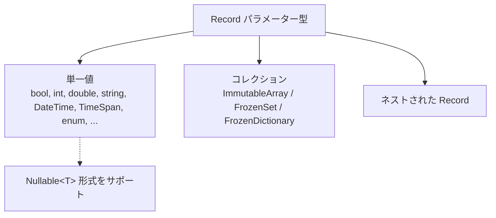

# 5.1 サポートされる型 (Schemata)

Sdp は Record のパラメーター型を静的解析し、その型が CSV セル値として表現可能かを検査します。この章では **どの型が許可されるか**、**各型にどの Attribute を付けられるか**、**どの Attribute が必須か** を整理します。

各 Attribute の詳しい説明は [5.2 Attribute カタログ](./02-attributes.md) に譲り、ここでは Schemata の観点からのみ扱います。Attribute 名をクリックすると該当項目へ移動します。

## 目次

ドキュメント登場順です。

- [一目で把握する](#一目で把握する)
- 単一値
  - [bool](#bool), [bool?](#bool-1)
  - [byte](#byte), [byte?](#byte-1)
  - [sbyte](#sbyte), [sbyte?](#sbyte-1)
  - [char](#char), [char?](#char-1)
  - [short](#short), [short?](#short-1)
  - [ushort](#ushort), [ushort?](#ushort-1)
  - [int](#int), [int?](#int-1)
  - [uint](#uint), [uint?](#uint-1)
  - [long](#long), [long?](#long-1)
  - [ulong](#ulong), [ulong?](#ulong-1)
  - [float](#float), [float?](#float-1)
  - [double](#double), [double?](#double-1)
  - [decimal](#decimal), [decimal?](#decimal-1)
  - [string](#string), [string?](#string-1)
  - [DateTime](#datetime), [DateTime?](#datetime-1)
  - [TimeSpan](#timespan), [TimeSpan?](#timespan-1)
  - [enum](#enum), [enum?](#enum-1)
- コレクション
  - [基本 Array / Set](#基本-array--set)
  - [単一カラムコレクション](#単一カラムコレクション)
  - [Record Array / Set](#record-array--set)
  - [Map (FrozenDictionary)](#map-frozendictionary)
  - [コレクション自体に対する制約](#コレクション自体に対する制約)
- [ネストされた Record](#ネストされた-record)

</br></br></br>

## 一目で把握する

Sdp が受け付ける型は 3 つのカテゴリに分かれます。



各項目は次の形式で整理します。

- **パース**: CSV セル値を読み込む方式
- **必須 Attribute**: その型に必ず付いていなければならない Attribute
- **使用可能な Attribute**: その型に意味を持って付けられる Attribute (必須に記載済みのものは再掲しません)

`[ColumnName]`, `[Ignore]`, `[Key]`, `[ForeignKey]`, `[SwitchForeignKey]` は位置さえ適切であればどの単一値型にも付けられるため、各項目の「使用可能な Attribute」には別途記載しません。詳しい仕様と使用例は [5.2](./02-attributes.md) を参照してください。

> **パース段階に関する補足** — 以下の項目の「パース」表記は抽出段階 (`ExcelColumnExtractor` が各カラムのスキーマでセル値を検証) を基準としています。ランタイム (`Sdp.Csv.CsvRecordMapper`) は検証済み CSV の文字列を次のように変換します。
> - `enum` — `Enum.Parse` でメンバー名 (または整数文字列) をパース (大文字小文字を区別)。`[Key]` でなければ `Enum.IsDefined` で定義された値のみ通過。
> - `DateTime` / `TimeSpan` — `[DateTimeFormat]` / `[TimeSpanFormat]` の format で `ParseExact` を呼び出す。
> - `string` — セル値をそのまま使用 (別途変換なし)。
> - その他の単一値 — `Convert.ChangeType(value, type, InvariantCulture)` の 1 行。
>
> 変換を終えた値に [`[Range]`](./02-attributes.md#attr-range)、[`[RegularExpression]`](./02-attributes.md#attr-regularexpression)、[`[CountRange]`](./02-attributes.md#attr-countrange) が付いていれば、ランタイムも抽出段階と同じルールで値をもう一度検査します。
>
> ただし Primary Key の重複や Record/Attribute 宣言の整合性は抽出段階 (宣言検査を含む) でのみ検査します。抽出段階を経ていない CSV をランタイムに直接渡すとこれらの検査が省かれるため、健全なパイプラインは常に抽出器を通した CSV のみを運用に乗せます。

---

</br></br></br>

## 単一値

### `bool`

- パース: `bool.TryParse` (大文字小文字を無視)
- 必須 Attribute: なし
- 使用可能な Attribute: —

</br>

### `bool?`

- パース: セル値が [`[NullString]`](./02-attributes.md#attr-nullstring) と等しければ `null`、そうでなければ `bool.TryParse`
- 必須 Attribute: [`[NullString]`](./02-attributes.md#attr-nullstring)
- 使用可能な Attribute: —

</br>

### `byte`

- パース: `byte.TryParse` (InvariantCulture)
- 必須 Attribute: なし
- 使用可能な Attribute: [`[Range]`](./02-attributes.md#attr-range)

</br>

### `byte?`

- パース: セル値が [`[NullString]`](./02-attributes.md#attr-nullstring) と等しければ `null`、そうでなければ `byte.TryParse`
- 必須 Attribute: [`[NullString]`](./02-attributes.md#attr-nullstring)
- 使用可能な Attribute: [`[Range]`](./02-attributes.md#attr-range)

</br>

### `sbyte`

- パース: `sbyte.TryParse` (InvariantCulture)
- 必須 Attribute: なし
- 使用可能な Attribute: [`[Range]`](./02-attributes.md#attr-range)

</br>

### `sbyte?`

- パース: セル値が [`[NullString]`](./02-attributes.md#attr-nullstring) と等しければ `null`、そうでなければ `sbyte.TryParse`
- 必須 Attribute: [`[NullString]`](./02-attributes.md#attr-nullstring)
- 使用可能な Attribute: [`[Range]`](./02-attributes.md#attr-range)

</br>

### `char`

- パース: 単一文字
- 必須 Attribute: なし
- 使用可能な Attribute: [`[Range]`](./02-attributes.md#attr-range)

</br>

### `char?`

- パース: セル値が [`[NullString]`](./02-attributes.md#attr-nullstring) と等しければ `null`、そうでなければ単一文字
- 必須 Attribute: [`[NullString]`](./02-attributes.md#attr-nullstring)
- 使用可能な Attribute: [`[Range]`](./02-attributes.md#attr-range)

</br>

### `short`

- パース: `short.TryParse` (InvariantCulture)
- 必須 Attribute: なし
- 使用可能な Attribute: [`[Range]`](./02-attributes.md#attr-range)

</br>

### `short?`

- パース: セル値が [`[NullString]`](./02-attributes.md#attr-nullstring) と等しければ `null`、そうでなければ `short.TryParse`
- 必須 Attribute: [`[NullString]`](./02-attributes.md#attr-nullstring)
- 使用可能な Attribute: [`[Range]`](./02-attributes.md#attr-range)

</br>

### `ushort`

- パース: `ushort.TryParse` (InvariantCulture)
- 必須 Attribute: なし
- 使用可能な Attribute: [`[Range]`](./02-attributes.md#attr-range)

</br>

### `ushort?`

- パース: セル値が [`[NullString]`](./02-attributes.md#attr-nullstring) と等しければ `null`、そうでなければ `ushort.TryParse`
- 必須 Attribute: [`[NullString]`](./02-attributes.md#attr-nullstring)
- 使用可能な Attribute: [`[Range]`](./02-attributes.md#attr-range)

</br>

### `int`

- パース: `int.TryParse` (InvariantCulture)
- 必須 Attribute: なし
- 使用可能な Attribute: [`[Range]`](./02-attributes.md#attr-range)

</br>

### `int?`

- パース: セル値が [`[NullString]`](./02-attributes.md#attr-nullstring) と等しければ `null`、そうでなければ `int.TryParse`
- 必須 Attribute: [`[NullString]`](./02-attributes.md#attr-nullstring)
- 使用可能な Attribute: [`[Range]`](./02-attributes.md#attr-range)

</br>

### `uint`

- パース: `uint.TryParse` (InvariantCulture)
- 必須 Attribute: なし
- 使用可能な Attribute: [`[Range]`](./02-attributes.md#attr-range)

</br>

### `uint?`

- パース: セル値が [`[NullString]`](./02-attributes.md#attr-nullstring) と等しければ `null`、そうでなければ `uint.TryParse`
- 必須 Attribute: [`[NullString]`](./02-attributes.md#attr-nullstring)
- 使用可能な Attribute: [`[Range]`](./02-attributes.md#attr-range)

</br>

### `long`

- パース: `long.TryParse` (InvariantCulture)
- 必須 Attribute: なし
- 使用可能な Attribute: [`[Range]`](./02-attributes.md#attr-range)

</br>

### `long?`

- パース: セル値が [`[NullString]`](./02-attributes.md#attr-nullstring) と等しければ `null`、そうでなければ `long.TryParse`
- 必須 Attribute: [`[NullString]`](./02-attributes.md#attr-nullstring)
- 使用可能な Attribute: [`[Range]`](./02-attributes.md#attr-range)

</br>

### `ulong`

- パース: `ulong.TryParse` (InvariantCulture)
- 必須 Attribute: なし
- 使用可能な Attribute: [`[Range]`](./02-attributes.md#attr-range)

</br>

### `ulong?`

- パース: セル値が [`[NullString]`](./02-attributes.md#attr-nullstring) と等しければ `null`、そうでなければ `ulong.TryParse`
- 必須 Attribute: [`[NullString]`](./02-attributes.md#attr-nullstring)
- 使用可能な Attribute: [`[Range]`](./02-attributes.md#attr-range)

</br>

### `float`

- パース: `float.TryParse` (InvariantCulture)
- 必須 Attribute: なし
- 使用可能な Attribute: [`[Range]`](./02-attributes.md#attr-range)

</br>

### `float?`

- パース: セル値が [`[NullString]`](./02-attributes.md#attr-nullstring) と等しければ `null`、そうでなければ `float.TryParse`
- 必須 Attribute: [`[NullString]`](./02-attributes.md#attr-nullstring)
- 使用可能な Attribute: [`[Range]`](./02-attributes.md#attr-range)

</br>

### `double`

- パース: `double.TryParse` (InvariantCulture)
- 必須 Attribute: なし
- 使用可能な Attribute: [`[Range]`](./02-attributes.md#attr-range)

</br>

### `double?`

- パース: セル値が [`[NullString]`](./02-attributes.md#attr-nullstring) と等しければ `null`、そうでなければ `double.TryParse`
- 必須 Attribute: [`[NullString]`](./02-attributes.md#attr-nullstring)
- 使用可能な Attribute: [`[Range]`](./02-attributes.md#attr-range)

</br>

### `decimal`

- パース: `decimal.TryParse` (InvariantCulture)
- 必須 Attribute: なし
- 使用可能な Attribute: [`[Range]`](./02-attributes.md#attr-range)

</br>

### `decimal?`

- パース: セル値が [`[NullString]`](./02-attributes.md#attr-nullstring) と等しければ `null`、そうでなければ `decimal.TryParse`
- 必須 Attribute: [`[NullString]`](./02-attributes.md#attr-nullstring)
- 使用可能な Attribute: [`[Range]`](./02-attributes.md#attr-range)

</br>

### `string`

- パース: セル値をそのまま文字列として使用
- 必須 Attribute: なし
- 使用可能な Attribute: [`[RegularExpression]`](./02-attributes.md#attr-regularexpression), [`[Range]`](./02-attributes.md#attr-range) (ordinal 比較 — `CompareOrdinal`、カルチャ非依存)

</br>

### `string?`

- パース: セル値が [`[NullString]`](./02-attributes.md#attr-nullstring) と等しければ `null`、そうでなければそのまま文字列
- 必須 Attribute: [`[NullString]`](./02-attributes.md#attr-nullstring)
- 使用可能な Attribute: [`[RegularExpression]`](./02-attributes.md#attr-regularexpression), [`[Range]`](./02-attributes.md#attr-range) (ordinal 比較 — `CompareOrdinal`、カルチャ非依存)

</br>

### `DateTime`

- パース: `DateTime.TryParseExact(cell, format, InvariantCulture)`
- 必須 Attribute: [`[DateTimeFormat]`](./02-attributes.md#attr-datetimeformat)
- 使用可能な Attribute: [`[Range]`](./02-attributes.md#attr-range)

</br>

### `DateTime?`

- パース: セル値が [`[NullString]`](./02-attributes.md#attr-nullstring) と等しければ `null`、そうでなければ `DateTime.TryParseExact`
- 必須 Attribute: [`[DateTimeFormat]`](./02-attributes.md#attr-datetimeformat), [`[NullString]`](./02-attributes.md#attr-nullstring)
- 使用可能な Attribute: [`[Range]`](./02-attributes.md#attr-range)

</br>

### `TimeSpan`

- パース: `TimeSpan.TryParseExact(cell, format, InvariantCulture)`
- 必須 Attribute: [`[TimeSpanFormat]`](./02-attributes.md#attr-timespanformat)
- 使用可能な Attribute: [`[Range]`](./02-attributes.md#attr-range)

</br>

### `TimeSpan?`

- パース: セル値が [`[NullString]`](./02-attributes.md#attr-nullstring) と等しければ `null`、そうでなければ `TimeSpan.TryParseExact`
- 必須 Attribute: [`[TimeSpanFormat]`](./02-attributes.md#attr-timespanformat), [`[NullString]`](./02-attributes.md#attr-nullstring)
- 使用可能な Attribute: [`[Range]`](./02-attributes.md#attr-range)

</br>

### `enum`

- パース: セル値を enum メンバー名としてマッチング (大文字小文字を区別)。抽出段階で定義されていない名前は拒否。ランタイムは `Enum.Parse` を呼び出すため整数文字列 (例: `"1"`) も受け付けますが、`[Key]` でなければ `Enum.IsDefined` 検査で定義された値のみ通過。
- 必須 Attribute: なし
- 使用可能な Attribute: [`[Range]`](./02-attributes.md#attr-range) (underlying integer を比較)
- 備考: [`[Key]`](./02-attributes.md#attr-key) と併用すると `Enum.IsDefined` 検査が省略され、ID コード空間として活用可能 (→ [5.3 型ブランディングパターン](./03-type-branding.md))。

</br>

### `enum?`

- パース: セル値が [`[NullString]`](./02-attributes.md#attr-nullstring) と等しければ `null`、そうでなければ enum メンバー名としてマッチング
- 必須 Attribute: [`[NullString]`](./02-attributes.md#attr-nullstring)
- 使用可能な Attribute: [`[Range]`](./02-attributes.md#attr-range) (underlying integer を比較)

---

</br></br></br>

## コレクション

3 種類のコレクション型がサポートされます。

|コレクション形態|固定サイズの指定|
|-|-|
|`ImmutableArray<T>`|[`[Length(n)]`](./02-attributes.md#attr-length)|
|`FrozenSet<T>`|[`[Length(n)]`](./02-attributes.md#attr-length)|
|`FrozenDictionary<K, V>`|[`[Length(n)]`](./02-attributes.md#attr-length)|

`ImmutableArray<T>` と `FrozenSet<T>` の要素がプリミティブな単一値である場合に限り、追加で **単一カラムモード** ([`[SingleColumnCollection]`](./02-attributes.md#attr-singlecolumncollection)) を使用できます。分割された要素数に制約が必要であれば [`[CountRange]`](./02-attributes.md#attr-countrange) を併せて付けます (任意)。

要素が nullable のコレクション (`ImmutableArray<int?>`, `FrozenSet<DateTime?>`, `FrozenDictionary<int, string?>` など) は、コレクションパラメーターの位置に [`[NullString]`](./02-attributes.md#attr-nullstring) が必須です。どのモード (Length / SingleColumnCollection) かに関わらず該当します。

### 基本 Array / Set

要素型 `T` が `bool`, `int`, `string`, `DateTime`, enum などの単一値である場合です。**マルチカラム方式** — `[Length(n)]` で固定サイズ。ヘッダーは `Col[0]`, `Col[1]`, ... `Col[n-1]` に展開されます。

```csharp
[StaticDataRecord("GameItems", "Items")]
public sealed record ItemRecord(
    int Id,
    string Name,
    [Length(3)] ImmutableArray<string> Tags);
```

標準ヘッダージェネレーターが出力するヘッダー (タブ区切り、可読性のために整列):

```
Id    Name    Tags[0]    Tags[1]    Tags[2]
```

Excel シートは次のように埋められます。

|       | **A** | **B**  | **C**     | **D**         | **E**     |
|-------|-------|--------|-----------|---------------|-----------|
| **1** | Id    | Name   | Tags[0]   | Tags[1]       | Tags[2]   |
| **2** | 1     | Potion | heal      | consumable    | small     |
| **3** | 2     | Sword  | melee     | iron          | starter   |

要素が `DateTime` / `TimeSpan` であれば、コレクションパラメーターにそれぞれ [`[DateTimeFormat]`](./02-attributes.md#attr-datetimeformat) / [`[TimeSpanFormat]`](./02-attributes.md#attr-timespanformat) が必須です。

```csharp
[StaticDataRecord("Events", "Schedules")]
public sealed record ScheduleRecord(
    int Id,
    string Title,
    [DateTimeFormat("yyyy-MM-dd")]
    [Length(2)] ImmutableArray<DateTime> Period);
```

標準ヘッダー:

```
Id    Title    Period[0]    Period[1]
```

### 単一カラムコレクション

`ImmutableArray<T>` / `FrozenSet<T>` の要素がプリミティブな単一値である場合に、1 つのセルに区切り文字でまとめて入れるモードです。`[SingleColumnCollection(",")]` で指定します。分割された要素数に制約が必要であれば [`[CountRange(min, max)]`](./02-attributes.md#attr-countrange) を併せて付けます (任意)。

```csharp
[StaticDataRecord("GameItems", "Items")]
public sealed record ItemRecord(
    int Id,
    string Name,
    [SingleColumnCollection(",")][CountRange(1, 5)] ImmutableArray<string> Tags);
```

標準ヘッダー:

```
Id    Name    Tags
```

Excel シート:

|       | **A** | **B**  | **C**                  |
|-------|-------|--------|------------------------|
| **1** | Id    | Name   | Tags                   |
| **2** | 1     | Potion | heal,consumable,small  |
| **3** | 2     | Sword  | melee,iron             |

このモードと `[Length]` は併用できません (どちらか一方を選ぶ必要があります)。要素が Record であるコレクションと Map (`FrozenDictionary`) には適用されません。

### Record Array / Set

要素がさらに別の Record である場合です。**`[Length(n)]` のみ可能** です。ヘッダーは `Col[i].Field1`, `Col[i].Field2`, ... に展開されます。要素 Record の各パラメーターは自身の型のルールを再帰的に従います。この程度からヘッダーが長くなるため、[3.2 標準ヘッダージェネレーター](../03-usage/02-header-generator.md) を併用すると手作業で揃える負担が軽くなります。

```csharp
public sealed record SubjectScore(string Subject, int Score);

[StaticDataRecord("StudentReport", "Grades")]
public sealed record StudentRecord(
    int Id,
    string Name,
    [Length(3)] ImmutableArray<SubjectScore> Subjects);
```

標準ヘッダー:

```
Id    Name    Subjects[0].Subject    Subjects[0].Score    Subjects[1].Subject    Subjects[1].Score    Subjects[2].Subject    Subjects[2].Score
```

Excel シート:

|       | **A** | **B**   | **C**                 | **D**               | **E**                 | **F**               | **G**                 | **H**               |
|-------|-------|---------|-----------------------|---------------------|-----------------------|---------------------|-----------------------|---------------------|
| **1** | Id    | Name    | Subjects[0].Subject   | Subjects[0].Score   | Subjects[1].Subject   | Subjects[1].Score   | Subjects[2].Subject   | Subjects[2].Score   |
| **2** | 1     | Alice   | Math                  | 90                  | English               | 85                  | Science               | 88                  |
| **3** | 2     | Bob     | Math                  | 70                  | English               | 95                  | Science               | 75                  |

### Map (`FrozenDictionary`)

**`[Length(n)]` のみ使用可能です。** [`[SingleColumnCollection]`](./02-attributes.md#attr-singlecolumncollection) は Map に適用できません。

Map の Value は **`[Key]` がちょうど 1 つ付いた Record** でなければなりません。Dictionary のキーは Value Record の `[Key]` パラメーターから抽出されます。そのためヘッダーには別途 `Key` カラムがなく、Value Record の `[Key]` パラメーター名がその位置を占めます。

#### Key がプリミティブな単一値の Map

```csharp
public sealed record SubjectScore(
    [Key] string Subject,
    int Score);

[StaticDataRecord("StudentReport", "Grades")]
public sealed record StudentRecord(
    int Id,
    string Name,
    [Length(3)] FrozenDictionary<string, SubjectScore> Scores);
```

標準ヘッダー (Value の `[Key]` パラメーター名 `Subject` がキーの位置を占める):

```
Id    Name    Scores[0].Subject    Scores[0].Score    Scores[1].Subject    Scores[1].Score    Scores[2].Subject    Scores[2].Score
```

Excel シート:

|       | **A** | **B**   | **C**             | **D**           | **E**             | **F**           | **G**             | **H**           |
|-------|-------|---------|-------------------|-----------------|-------------------|-----------------|-------------------|-----------------|
| **1** | Id    | Name    | Scores[0].Subject | Scores[0].Score | Scores[1].Subject | Scores[1].Score | Scores[2].Subject | Scores[2].Score |
| **2** | 1     | Alice   | Math              | 90              | English           | 85              | Science           | 88              |
| **3** | 2     | Bob     | Math              | 70              | English           | 95              | Science           | 75              |

#### Key が Record の Map

`CharId(int Value)` のようなブランディング用の単一パラメーター record から複数フィールドを持つ record まで、Key の位置に入ることができます。このとき **Key の record 型と Value Record `[Key]` パラメーターの record 型が同じでなければなりません**。

```csharp
public sealed record ItemKey(int Id, string Type);

public sealed record ItemStatus(
    [Key] ItemKey Key,
    int Level,
    int Power);

[StaticDataRecord("GameData", "Items")]
public sealed record InventoryRecord(
    [Length(2)] FrozenDictionary<ItemKey, ItemStatus> Inventory);
```

標準ヘッダー (Value の `[Key]` パラメーター名 `Key` が位置を占め、その下に record が展開される):

```
Inventory[0].Key.Id    Inventory[0].Key.Type    Inventory[0].Level    Inventory[0].Power    Inventory[1].Key.Id    Inventory[1].Key.Type    Inventory[1].Level    Inventory[1].Power
```

この程度のヘッダーからは手作業で揃えるのが難しくなるため、[3.2 標準ヘッダージェネレーター](../03-usage/02-header-generator.md) が事実上必須です。

#### Key 型のサポート表

|Key 型|サポート|備考|
|-|-|-|
|プリミティブな単一値 (`int`, `string`, `DateTime`, enum, ...)|O|`DateTime` / `TimeSpan` は [`[DateTimeFormat]`](./02-attributes.md#attr-datetimeformat) / [`[TimeSpanFormat]`](./02-attributes.md#attr-timespanformat) が必要|
|Nullable (`K?`)|X|Map の Key は nullable にできない|
|Record (単一/複数フィールド)|O|Value の `[Key]` パラメーターの型と同一の record でなければならない|

#### Value 型のサポート表

|Value 型|サポート|備考|
|-|-|-|
|Record (`[Key]` がちょうど 1 つ)|O|`[Key]` パラメーターの型と Map の `K` 型が一致しなければならない|
|Nullable Record (`MyRecord?`)|X|コレクションの Value の位置に nullable は許可されない|

### コレクション自体に対する制約

- **コレクション自体を Nullable として宣言できません。** `ImmutableArray<T>?`, `FrozenSet<T>?`, `FrozenDictionary<K, V>?` はすべて拒否されます。「要素がない状態」は空のコレクションで表現します。

---

</br></br></br>

## ネストされた Record

Record のパラメーターがさらに別の Record であることがあります。このとき内部 Record のすべてのパラメーターは、このドキュメントで説明したルールを再帰的に従います。

```csharp
public sealed record Position(int X, int Y);

[StaticDataRecord("Spawn", "Spawns")]
public sealed record SpawnPointRecord(
    int Id,
    Position Point);
```

標準ヘッダー:

```
Id    Point.X    Point.Y
```

Excel シート:

|       | **A** | **B**     | **C**     |
|-------|-------|-----------|-----------|
| **1** | Id    | Point.X   | Point.Y   |
| **2** | 1     | 10        | 20        |
| **3** | 2     | 30        | 40        |

内部 Record の各パラメーターが自身の位置のカラムに展開されます。展開されたヘッダーが長くなれば [3.2 標準ヘッダージェネレーター](../03-usage/02-header-generator.md) で自動的に組み立てられます。

- 使用可能な Attribute: [`[ColumnName]`](./02-attributes.md#attr-columnname) でヘッダーの接頭辞を変更できます。
- **Nullable Record** (`Position?`) は許可されません。
- 循環参照 (Record が自分自身を直接/間接に含む) も拒否されます。

---

[← 前へ: 4.2 ExcelColumnExtractor](../04-cli-tools/02-column-extractor.md) | [目次](../README.md) | [次へ: 5.2 Attribute カタログ →](./02-attributes.md)
