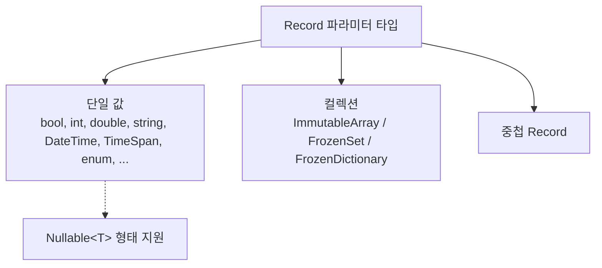

# 5.1 지원 타입 (Schemata)

Sdp 는 Record 의 파라미터 타입을 정적 분석해, 그 타입이 CSV 셀 값으로 표현 가능한지 검사합니다. 이 장은 **어떤 타입이 허용되는지**, **각 타입에 어떤 Attribute 를 붙일 수 있는지**, **어떤 Attribute 가 필수인지** 를 정리합니다.

각 Attribute 의 자세한 설명은 [5.2 Attribute 카탈로그](./02-attributes.md) 로 미루고, 여기서는 Schemata 관점에서만 다룹니다. Attribute 이름을 클릭하면 해당 항목으로 이동합니다.

## 목차

문서 등장순입니다.

- [한눈에 보기](#한눈에-보기)
- 단일 값
  - [bool](#bool), [bool?](#bool-1)
  - [byte](#byte), [byte?](#byte-1)
  - [sbyte](#sbyte), [sbyte?](#sbyte-1)
  - [char](#char), [char?](#char-1)
  - [short](#short), [short?](#short-1)
  - [ushort](#ushort), [ushort?](#ushort-1)
  - [int](#int), [int?](#int-1)
  - [uint](#uint), [uint?](#uint-1)
  - [long](#long), [long?](#long-1)
  - [ulong](#ulong), [ulong?](#ulong-1)
  - [float](#float), [float?](#float-1)
  - [double](#double), [double?](#double-1)
  - [decimal](#decimal), [decimal?](#decimal-1)
  - [string](#string), [string?](#string-1)
  - [DateTime](#datetime), [DateTime?](#datetime-1)
  - [TimeSpan](#timespan), [TimeSpan?](#timespan-1)
  - [enum](#enum), [enum?](#enum-1)
- 컬렉션
  - [기본 Array / Set](#기본-array--set)
  - [단일 컬럼 컬렉션](#단일-컬럼-컬렉션)
  - [Record Array / Set](#record-array--set)
  - [Map (FrozenDictionary)](#map-frozendictionary)
  - [컬렉션 자체 제약](#컬렉션-자체에-대한-제약)
- [중첩 Record](#중첩-record)

</br></br></br>

## 한눈에 보기

Sdp 가 받는 타입은 세 범주입니다.



각 항목은 다음 양식으로 정리합니다.

- **파싱**: CSV 셀 값을 읽어 들이는 방식
- **필수 Attribute**: 해당 타입에 반드시 붙어 있어야 하는 Attribute
- **사용 가능한 Attribute**: 해당 타입에 의미 있게 붙일 수 있는 Attribute (필수에 적힌 것은 다시 적지 않습니다)

`[ColumnName]`, `[Ignore]`, `[Key]`, `[ForeignKey]`, `[SwitchForeignKey]` 는 자리에 맞기만 하면 어떤 단일 값 타입에도 붙일 수 있으므로 각 항목의 "사용 가능한 Attribute" 에서는 따로 적지 않습니다. 자세한 명세와 사용 예는 [5.2](./02-attributes.md) 를 참고하세요.

> **파싱 단계 보충** — 아래 항목의 "파싱" 표기는 추출 단계 (`ExcelColumnExtractor` 가 각 컬럼의 스키마로 셀 값을 검증) 기준입니다. 런타임 (`Sdp.Csv.CsvRecordMapper`) 은 검증된 CSV 의 문자열을 다음과 같이 변환합니다.
> - `enum` — `Enum.Parse` 로 멤버 이름(또는 정수 문자열) 파싱 (대소문자 구별). `[Key]` 가 아니면 `Enum.IsDefined` 로 정의된 값만 통과.
> - `DateTime` / `TimeSpan` — `ParseExact` 를 `[DateTimeFormat]` / `[TimeSpanFormat]` 의 format 으로 호출.
> - `string` — 셀 값을 그대로 사용 (별도 변환 없음).
> - 그 외 단일 값 — `Convert.ChangeType(value, type, InvariantCulture)` 한 줄.
>
> 변환을 마친 값에 [`[Range]`](./02-attributes.md#attr-range), [`[RegularExpression]`](./02-attributes.md#attr-regularexpression), [`[CountRange]`](./02-attributes.md#attr-countrange) 가 붙어 있으면, 런타임도 추출 단계와 같은 규칙으로 값을 다시 한번 검사합니다.
>
> 다만 Primary Key 중복이나 Record/Attribute 선언 정합성은 추출 단계(선언 검사 포함)에서만 검사합니다. 추출 단계를 거치지 않은 CSV 를 런타임에 직접 넣으면 이런 검사가 빠지므로, 정상적인 파이프라인은 항상 추출기를 거친 CSV 만 운영에 올립니다.

---

</br></br></br>

## 단일 값

### `bool`

- 파싱: `bool.TryParse` (대소문자 무시)
- 필수 Attribute: 없음
- 사용 가능한 Attribute: —

</br>

### `bool?`

- 파싱: 셀 값이 [`[NullString]`](./02-attributes.md#attr-nullstring) 과 같으면 `null`, 아니면 `bool.TryParse`
- 필수 Attribute: [`[NullString]`](./02-attributes.md#attr-nullstring)
- 사용 가능한 Attribute: —

</br>

### `byte`

- 파싱: `byte.TryParse` (InvariantCulture)
- 필수 Attribute: 없음
- 사용 가능한 Attribute: [`[Range]`](./02-attributes.md#attr-range)

</br>

### `byte?`

- 파싱: 셀 값이 [`[NullString]`](./02-attributes.md#attr-nullstring) 과 같으면 `null`, 아니면 `byte.TryParse`
- 필수 Attribute: [`[NullString]`](./02-attributes.md#attr-nullstring)
- 사용 가능한 Attribute: [`[Range]`](./02-attributes.md#attr-range)

</br>

### `sbyte`

- 파싱: `sbyte.TryParse` (InvariantCulture)
- 필수 Attribute: 없음
- 사용 가능한 Attribute: [`[Range]`](./02-attributes.md#attr-range)

</br>

### `sbyte?`

- 파싱: 셀 값이 [`[NullString]`](./02-attributes.md#attr-nullstring) 과 같으면 `null`, 아니면 `sbyte.TryParse`
- 필수 Attribute: [`[NullString]`](./02-attributes.md#attr-nullstring)
- 사용 가능한 Attribute: [`[Range]`](./02-attributes.md#attr-range)

</br>

### `char`

- 파싱: 단일 문자
- 필수 Attribute: 없음
- 사용 가능한 Attribute: [`[Range]`](./02-attributes.md#attr-range)

</br>

### `char?`

- 파싱: 셀 값이 [`[NullString]`](./02-attributes.md#attr-nullstring) 과 같으면 `null`, 아니면 단일 문자
- 필수 Attribute: [`[NullString]`](./02-attributes.md#attr-nullstring)
- 사용 가능한 Attribute: [`[Range]`](./02-attributes.md#attr-range)

</br>

### `short`

- 파싱: `short.TryParse` (InvariantCulture)
- 필수 Attribute: 없음
- 사용 가능한 Attribute: [`[Range]`](./02-attributes.md#attr-range)

</br>

### `short?`

- 파싱: 셀 값이 [`[NullString]`](./02-attributes.md#attr-nullstring) 과 같으면 `null`, 아니면 `short.TryParse`
- 필수 Attribute: [`[NullString]`](./02-attributes.md#attr-nullstring)
- 사용 가능한 Attribute: [`[Range]`](./02-attributes.md#attr-range)

</br>

### `ushort`

- 파싱: `ushort.TryParse` (InvariantCulture)
- 필수 Attribute: 없음
- 사용 가능한 Attribute: [`[Range]`](./02-attributes.md#attr-range)

</br>

### `ushort?`

- 파싱: 셀 값이 [`[NullString]`](./02-attributes.md#attr-nullstring) 과 같으면 `null`, 아니면 `ushort.TryParse`
- 필수 Attribute: [`[NullString]`](./02-attributes.md#attr-nullstring)
- 사용 가능한 Attribute: [`[Range]`](./02-attributes.md#attr-range)

</br>

### `int`

- 파싱: `int.TryParse` (InvariantCulture)
- 필수 Attribute: 없음
- 사용 가능한 Attribute: [`[Range]`](./02-attributes.md#attr-range)

</br>

### `int?`

- 파싱: 셀 값이 [`[NullString]`](./02-attributes.md#attr-nullstring) 과 같으면 `null`, 아니면 `int.TryParse`
- 필수 Attribute: [`[NullString]`](./02-attributes.md#attr-nullstring)
- 사용 가능한 Attribute: [`[Range]`](./02-attributes.md#attr-range)

</br>

### `uint`

- 파싱: `uint.TryParse` (InvariantCulture)
- 필수 Attribute: 없음
- 사용 가능한 Attribute: [`[Range]`](./02-attributes.md#attr-range)

</br>

### `uint?`

- 파싱: 셀 값이 [`[NullString]`](./02-attributes.md#attr-nullstring) 과 같으면 `null`, 아니면 `uint.TryParse`
- 필수 Attribute: [`[NullString]`](./02-attributes.md#attr-nullstring)
- 사용 가능한 Attribute: [`[Range]`](./02-attributes.md#attr-range)

</br>

### `long`

- 파싱: `long.TryParse` (InvariantCulture)
- 필수 Attribute: 없음
- 사용 가능한 Attribute: [`[Range]`](./02-attributes.md#attr-range)

</br>

### `long?`

- 파싱: 셀 값이 [`[NullString]`](./02-attributes.md#attr-nullstring) 과 같으면 `null`, 아니면 `long.TryParse`
- 필수 Attribute: [`[NullString]`](./02-attributes.md#attr-nullstring)
- 사용 가능한 Attribute: [`[Range]`](./02-attributes.md#attr-range)

</br>

### `ulong`

- 파싱: `ulong.TryParse` (InvariantCulture)
- 필수 Attribute: 없음
- 사용 가능한 Attribute: [`[Range]`](./02-attributes.md#attr-range)

</br>

### `ulong?`

- 파싱: 셀 값이 [`[NullString]`](./02-attributes.md#attr-nullstring) 과 같으면 `null`, 아니면 `ulong.TryParse`
- 필수 Attribute: [`[NullString]`](./02-attributes.md#attr-nullstring)
- 사용 가능한 Attribute: [`[Range]`](./02-attributes.md#attr-range)

</br>

### `float`

- 파싱: `float.TryParse` (InvariantCulture)
- 필수 Attribute: 없음
- 사용 가능한 Attribute: [`[Range]`](./02-attributes.md#attr-range)

</br>

### `float?`

- 파싱: 셀 값이 [`[NullString]`](./02-attributes.md#attr-nullstring) 과 같으면 `null`, 아니면 `float.TryParse`
- 필수 Attribute: [`[NullString]`](./02-attributes.md#attr-nullstring)
- 사용 가능한 Attribute: [`[Range]`](./02-attributes.md#attr-range)

</br>

### `double`

- 파싱: `double.TryParse` (InvariantCulture)
- 필수 Attribute: 없음
- 사용 가능한 Attribute: [`[Range]`](./02-attributes.md#attr-range)

</br>

### `double?`

- 파싱: 셀 값이 [`[NullString]`](./02-attributes.md#attr-nullstring) 과 같으면 `null`, 아니면 `double.TryParse`
- 필수 Attribute: [`[NullString]`](./02-attributes.md#attr-nullstring)
- 사용 가능한 Attribute: [`[Range]`](./02-attributes.md#attr-range)

</br>

### `decimal`

- 파싱: `decimal.TryParse` (InvariantCulture)
- 필수 Attribute: 없음
- 사용 가능한 Attribute: [`[Range]`](./02-attributes.md#attr-range)

</br>

### `decimal?`

- 파싱: 셀 값이 [`[NullString]`](./02-attributes.md#attr-nullstring) 과 같으면 `null`, 아니면 `decimal.TryParse`
- 필수 Attribute: [`[NullString]`](./02-attributes.md#attr-nullstring)
- 사용 가능한 Attribute: [`[Range]`](./02-attributes.md#attr-range)

</br>

### `string`

- 파싱: 셀 값을 그대로 문자열로 사용
- 필수 Attribute: 없음
- 사용 가능한 Attribute: [`[RegularExpression]`](./02-attributes.md#attr-regularexpression), [`[Range]`](./02-attributes.md#attr-range) (ordinal 비교 — `CompareOrdinal`, 문화권 무관)

</br>

### `string?`

- 파싱: 셀 값이 [`[NullString]`](./02-attributes.md#attr-nullstring) 과 같으면 `null`, 아니면 그대로 문자열
- 필수 Attribute: [`[NullString]`](./02-attributes.md#attr-nullstring)
- 사용 가능한 Attribute: [`[RegularExpression]`](./02-attributes.md#attr-regularexpression), [`[Range]`](./02-attributes.md#attr-range) (ordinal 비교 — `CompareOrdinal`, 문화권 무관)

</br>

### `DateTime`

- 파싱: `DateTime.TryParseExact(cell, format, InvariantCulture)`
- 필수 Attribute: [`[DateTimeFormat]`](./02-attributes.md#attr-datetimeformat)
- 사용 가능한 Attribute: [`[Range]`](./02-attributes.md#attr-range)

</br>

### `DateTime?`

- 파싱: 셀 값이 [`[NullString]`](./02-attributes.md#attr-nullstring) 과 같으면 `null`, 아니면 `DateTime.TryParseExact`
- 필수 Attribute: [`[DateTimeFormat]`](./02-attributes.md#attr-datetimeformat), [`[NullString]`](./02-attributes.md#attr-nullstring)
- 사용 가능한 Attribute: [`[Range]`](./02-attributes.md#attr-range)

</br>

### `TimeSpan`

- 파싱: `TimeSpan.TryParseExact(cell, format, InvariantCulture)`
- 필수 Attribute: [`[TimeSpanFormat]`](./02-attributes.md#attr-timespanformat)
- 사용 가능한 Attribute: [`[Range]`](./02-attributes.md#attr-range)

</br>

### `TimeSpan?`

- 파싱: 셀 값이 [`[NullString]`](./02-attributes.md#attr-nullstring) 과 같으면 `null`, 아니면 `TimeSpan.TryParseExact`
- 필수 Attribute: [`[TimeSpanFormat]`](./02-attributes.md#attr-timespanformat), [`[NullString]`](./02-attributes.md#attr-nullstring)
- 사용 가능한 Attribute: [`[Range]`](./02-attributes.md#attr-range)

</br>

### `enum`

- 파싱: 셀 값을 enum 멤버 이름으로 매칭 (대소문자 구별). 추출 단계에서 정의되지 않은 이름은 거부. 런타임은 `Enum.Parse` 호출이라 정수 문자열 (예: `"1"`) 도 받지만, `[Key]` 가 아니면 `Enum.IsDefined` 검사로 정의된 값만 통과.
- 필수 Attribute: 없음
- 사용 가능한 Attribute: [`[Range]`](./02-attributes.md#attr-range) (underlying integer 비교)
- 비고: [`[Key]`](./02-attributes.md#attr-key) 와 함께 쓰면 `Enum.IsDefined` 검사가 생략되어 ID 코드 공간으로 활용 가능 (→ [5.3 타입 브랜딩 패턴](./03-type-branding.md)).

</br>

### `enum?`

- 파싱: 셀 값이 [`[NullString]`](./02-attributes.md#attr-nullstring) 과 같으면 `null`, 아니면 enum 멤버 이름으로 매칭
- 필수 Attribute: [`[NullString]`](./02-attributes.md#attr-nullstring)
- 사용 가능한 Attribute: [`[Range]`](./02-attributes.md#attr-range) (underlying integer 비교)

---

</br></br></br>

## 컬렉션

세 가지 컬렉션 타입이 지원됩니다.

|컬렉션 형태|고정 크기 표시|
|-|-|
|`ImmutableArray<T>`|[`[Length(n)]`](./02-attributes.md#attr-length)|
|`FrozenSet<T>`|[`[Length(n)]`](./02-attributes.md#attr-length)|
|`FrozenDictionary<K, V>`|[`[Length(n)]`](./02-attributes.md#attr-length)|

`ImmutableArray<T>` 와 `FrozenSet<T>` 의 원소가 원시 단일 값일 때만 추가로 **단일 컬럼 모드** ([`[SingleColumnCollection]`](./02-attributes.md#attr-singlecolumncollection)) 를 쓸 수 있습니다. 분할된 원소 개수에 제약이 필요하면 [`[CountRange]`](./02-attributes.md#attr-countrange) 를 함께 붙입니다 (선택).

원소가 nullable 인 컬렉션 (`ImmutableArray<int?>`, `FrozenSet<DateTime?>`, `FrozenDictionary<int, string?>` 등) 은 컬렉션 파라미터 자리에 [`[NullString]`](./02-attributes.md#attr-nullstring) 이 필수입니다. 어느 모드 (Length / SingleColumnCollection) 인지와 무관합니다.

### 기본 Array / Set

원소 타입 `T` 가 `bool`, `int`, `string`, `DateTime`, enum 등 단일 값인 경우입니다. **다중 컬럼 방식** — `[Length(n)]` 으로 고정 크기. 헤더가 `Col[0]`, `Col[1]`, ... `Col[n-1]` 로 펼쳐집니다.

```csharp
[StaticDataRecord("GameItems", "Items")]
public sealed record ItemRecord(
    int Id,
    string Name,
    [Length(3)] ImmutableArray<string> Tags);
```

표준 헤더 생성기가 출력하는 헤더 (탭 구분, 가독성을 위해 정렬):

```
Id    Name    Tags[0]    Tags[1]    Tags[2]
```

엑셀 시트는 다음과 같이 채워집니다.

|       | **A** | **B**  | **C**     | **D**         | **E**     |
|-------|-------|--------|-----------|---------------|-----------|
| **1** | Id    | Name   | Tags[0]   | Tags[1]       | Tags[2]   |
| **2** | 1     | Potion | heal      | consumable    | small     |
| **3** | 2     | Sword  | melee     | iron          | starter   |

원소가 `DateTime` / `TimeSpan` 이면 컬렉션 파라미터에 각각 [`[DateTimeFormat]`](./02-attributes.md#attr-datetimeformat) / [`[TimeSpanFormat]`](./02-attributes.md#attr-timespanformat) 이 필수입니다.

```csharp
[StaticDataRecord("Events", "Schedules")]
public sealed record ScheduleRecord(
    int Id,
    string Title,
    [DateTimeFormat("yyyy-MM-dd")]
    [Length(2)] ImmutableArray<DateTime> Period);
```

표준 헤더:

```
Id    Title    Period[0]    Period[1]
```

### 단일 컬럼 컬렉션

`ImmutableArray<T>` / `FrozenSet<T>` 의 원소가 원시 단일 값일 때, 한 셀에 구분자로 묶어 두는 모드입니다. `[SingleColumnCollection(",")]` 로 표시합니다. 분할된 원소 개수에 제약이 필요하면 [`[CountRange(min, max)]`](./02-attributes.md#attr-countrange) 를 함께 붙입니다 (선택).

```csharp
[StaticDataRecord("GameItems", "Items")]
public sealed record ItemRecord(
    int Id,
    string Name,
    [SingleColumnCollection(",")][CountRange(1, 5)] ImmutableArray<string> Tags);
```

표준 헤더:

```
Id    Name    Tags
```

엑셀 시트:

|       | **A** | **B**  | **C**                  |
|-------|-------|--------|------------------------|
| **1** | Id    | Name   | Tags                   |
| **2** | 1     | Potion | heal,consumable,small  |
| **3** | 2     | Sword  | melee,iron             |

이 모드와 `[Length]` 는 함께 쓸 수 없습니다 (둘 중 하나만 골라야 합니다). 원소가 Record 인 컬렉션과 Map (`FrozenDictionary`) 에는 적용되지 않습니다.

### Record Array / Set

원소가 또 다른 Record 인 경우입니다. **`[Length(n)]` 만 가능** 합니다. 헤더는 `Col[i].Field1`, `Col[i].Field2`, ... 로 펼쳐집니다. 원소 Record 의 각 파라미터는 자기 타입의 규칙을 재귀적으로 따릅니다. 이 정도부터 헤더가 길어지므로 [3.2 표준 헤더 생성기](../03-usage/02-header-generator.md) 를 함께 쓰면 손으로 맞출 부담이 줄어듭니다.

```csharp
public sealed record SubjectScore(string Subject, int Score);

[StaticDataRecord("StudentReport", "Grades")]
public sealed record StudentRecord(
    int Id,
    string Name,
    [Length(3)] ImmutableArray<SubjectScore> Subjects);
```

표준 헤더:

```
Id    Name    Subjects[0].Subject    Subjects[0].Score    Subjects[1].Subject    Subjects[1].Score    Subjects[2].Subject    Subjects[2].Score
```

엑셀 시트:

|       | **A** | **B**   | **C**                 | **D**               | **E**                 | **F**               | **G**                 | **H**               |
|-------|-------|---------|-----------------------|---------------------|-----------------------|---------------------|-----------------------|---------------------|
| **1** | Id    | Name    | Subjects[0].Subject   | Subjects[0].Score   | Subjects[1].Subject   | Subjects[1].Score   | Subjects[2].Subject   | Subjects[2].Score   |
| **2** | 1     | Alice   | Math                  | 90                  | English               | 85                  | Science               | 88                  |
| **3** | 2     | Bob     | Math                  | 70                  | English               | 95                  | Science               | 75                  |

### Map (`FrozenDictionary`)

**`[Length(n)]` 만 사용 가능합니다.** [`[SingleColumnCollection]`](./02-attributes.md#attr-singlecolumncollection) 은 Map 에 적용할 수 없습니다.

Map 의 Value 는 **`[Key]` 가 정확히 하나 붙은 Record** 여야 합니다. Dictionary 의 키는 Value Record 의 `[Key]` 파라미터에서 추출됩니다. 그래서 헤더에는 별도 `Key` 컬럼이 없고, Value Record 의 `[Key]` 파라미터 이름이 그 자리를 차지합니다.

#### Key 가 원시 단일 값인 Map

```csharp
public sealed record SubjectScore(
    [Key] string Subject,
    int Score);

[StaticDataRecord("StudentReport", "Grades")]
public sealed record StudentRecord(
    int Id,
    string Name,
    [Length(3)] FrozenDictionary<string, SubjectScore> Scores);
```

표준 헤더 (Value 의 `[Key]` 파라미터 이름 `Subject` 가 키 자리를 차지):

```
Id    Name    Scores[0].Subject    Scores[0].Score    Scores[1].Subject    Scores[1].Score    Scores[2].Subject    Scores[2].Score
```

엑셀 시트:

|       | **A** | **B**   | **C**             | **D**           | **E**             | **F**           | **G**             | **H**           |
|-------|-------|---------|-------------------|-----------------|-------------------|-----------------|-------------------|-----------------|
| **1** | Id    | Name    | Scores[0].Subject | Scores[0].Score | Scores[1].Subject | Scores[1].Score | Scores[2].Subject | Scores[2].Score |
| **2** | 1     | Alice   | Math              | 90              | English           | 85              | Science           | 88              |
| **3** | 2     | Bob     | Math              | 70              | English           | 95              | Science           | 75              |

#### Key 가 Record 인 Map

`CharId(int Value)` 같은 브랜딩용 단일 파라미터 record 부터 여러 필드를 가진 record 까지 Key 자리에 들어올 수 있습니다. 이때 **Key 의 record 타입과 Value Record `[Key]` 파라미터의 record 타입이 같아야** 합니다.

```csharp
public sealed record ItemKey(int Id, string Type);

public sealed record ItemStatus(
    [Key] ItemKey Key,
    int Level,
    int Power);

[StaticDataRecord("GameData", "Items")]
public sealed record InventoryRecord(
    [Length(2)] FrozenDictionary<ItemKey, ItemStatus> Inventory);
```

표준 헤더 (Value 의 `[Key]` 파라미터 이름 `Key` 가 자리잡고, 그 아래로 record 가 펼쳐짐):

```
Inventory[0].Key.Id    Inventory[0].Key.Type    Inventory[0].Level    Inventory[0].Power    Inventory[1].Key.Id    Inventory[1].Key.Type    Inventory[1].Level    Inventory[1].Power
```

이 정도 헤더부터는 손으로 맞추기가 어려워지므로 [3.2 표준 헤더 생성기](../03-usage/02-header-generator.md) 가 사실상 필수입니다.

#### Key 타입 지원표

|Key 타입|지원|비고|
|-|-|-|
|원시 단일 값 (`int`, `string`, `DateTime`, enum, ...)|O|`DateTime` / `TimeSpan` 은 [`[DateTimeFormat]`](./02-attributes.md#attr-datetimeformat) / [`[TimeSpanFormat]`](./02-attributes.md#attr-timespanformat) 필요|
|Nullable (`K?`)|X|Map 의 Key 는 nullable 일 수 없음|
|Record (단일/다중 필드)|O|Value 의 `[Key]` 파라미터 타입과 동일한 record 여야 함|

#### Value 타입 지원표

|Value 타입|지원|비고|
|-|-|-|
|Record (`[Key]` 가 정확히 하나)|O|`[Key]` 파라미터의 타입과 Map 의 `K` 타입이 일치해야 함|
|Nullable Record (`MyRecord?`)|X|컬렉션의 Value 자리에 nullable 을 허용하지 않음|

### 컬렉션 자체에 대한 제약

- **컬렉션 자체를 Nullable 로 선언할 수 없습니다.** `ImmutableArray<T>?`, `FrozenSet<T>?`, `FrozenDictionary<K, V>?` 는 모두 거부됩니다. "원소가 없는 상태" 는 빈 컬렉션으로 표현합니다.

---

</br></br></br>

## 중첩 Record

Record 의 파라미터가 또 다른 Record 일 수 있습니다. 이때 내부 Record 의 모든 파라미터는 이 문서에서 설명한 규칙을 재귀적으로 따릅니다.

```csharp
public sealed record Position(int X, int Y);

[StaticDataRecord("Spawn", "Spawns")]
public sealed record SpawnPointRecord(
    int Id,
    Position Point);
```

표준 헤더:

```
Id    Point.X    Point.Y
```

엑셀 시트:

|       | **A** | **B**     | **C**     |
|-------|-------|-----------|-----------|
| **1** | Id    | Point.X   | Point.Y   |
| **2** | 1     | 10        | 20        |
| **3** | 2     | 30        | 40        |

내부 Record 의 각 파라미터가 자기 자리의 컬럼으로 펼쳐집니다. 펼쳐진 헤더가 길어지면 [3.2 표준 헤더 생성기](../03-usage/02-header-generator.md) 로 자동 조립할 수 있습니다.

- 사용 가능한 Attribute: [`[ColumnName]`](./02-attributes.md#attr-columnname) 으로 헤더 접두사를 바꿀 수 있습니다.
- **Nullable Record** (`Position?`) 는 허용되지 않습니다.
- 순환 참조 (Record 가 자기 자신을 직접/간접 포함) 도 거부됩니다.

---

[← 이전: 4.2 ExcelColumnExtractor](../04-cli-tools/02-column-extractor.md) | [목차](../README.md) | [다음: 5.2 Attribute 카탈로그 →](./02-attributes.md)
