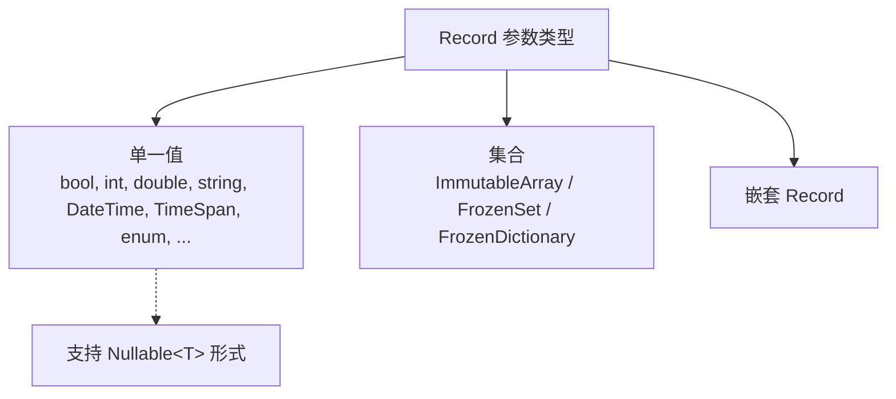

# 5.1 支持的类型 (Schemata)

Sdp 会对 Record 的参数类型进行静态分析，检查该类型是否能够表示为 CSV 单元格值。本章整理 **哪些类型被允许**、**每种类型可以附加哪些 Attribute**、**哪些 Attribute 是必需的**。

各 Attribute 的详细说明留待 [5.2 Attribute 目录](./02-attributes.md)，这里仅从 Schemata 的角度展开。点击 Attribute 名称即可跳转到对应条目。

## 目录

按文档中出现的顺序排列。

- [一览](#一览)
- 单一值
  - [bool](#bool), [bool?](#bool-1)
  - [byte](#byte), [byte?](#byte-1)
  - [sbyte](#sbyte), [sbyte?](#sbyte-1)
  - [char](#char), [char?](#char-1)
  - [short](#short), [short?](#short-1)
  - [ushort](#ushort), [ushort?](#ushort-1)
  - [int](#int), [int?](#int-1)
  - [uint](#uint), [uint?](#uint-1)
  - [long](#long), [long?](#long-1)
  - [ulong](#ulong), [ulong?](#ulong-1)
  - [float](#float), [float?](#float-1)
  - [double](#double), [double?](#double-1)
  - [decimal](#decimal), [decimal?](#decimal-1)
  - [string](#string), [string?](#string-1)
  - [DateTime](#datetime), [DateTime?](#datetime-1)
  - [TimeSpan](#timespan), [TimeSpan?](#timespan-1)
  - [enum](#enum), [enum?](#enum-1)
- 集合
  - [基本 Array / Set](#基本-array--set)
  - [单列集合](#单列集合)
  - [Record Array / Set](#record-array--set)
  - [Map (FrozenDictionary)](#map-frozendictionary)
  - [集合自身的约束](#集合自身的约束)
- [嵌套 Record](#嵌套-record)

</br></br></br>

## 一览

Sdp 接受的类型分为三个类别。



每个条目按以下格式整理。

- **解析**: 读取 CSV 单元格值的方式
- **必需 Attribute**: 该类型必须附加的 Attribute
- **可用 Attribute**: 可以有意义地附加到该类型的 Attribute (已列为必需的不再重复)

`[ColumnName]`、`[Ignore]`、`[Key]`、`[ForeignKey]`、`[SwitchForeignKey]` 只要位置合适就可以附加到任何单一值类型，因此不会在各条目的「可用 Attribute」中单独列出。详细规格和使用示例请参阅 [5.2](./02-attributes.md)。

> **关于解析阶段的补充** — 以下条目的「解析」标注以提取阶段 (`ExcelColumnExtractor` 用各列的 schema 验证单元格值) 为准。运行时 (`Sdp.Csv.CsvRecordMapper`) 按如下方式转换已验证 CSV 的字符串。
> - `enum` — 用 `Enum.Parse` 解析成员名 (或整数字符串) (区分大小写)。若不是 `[Key]`，则只有经 `Enum.IsDefined` 定义的值才能通过。
> - `DateTime` / `TimeSpan` — 用 `[DateTimeFormat]` / `[TimeSpanFormat]` 的 format 调用 `ParseExact`。
> - `string` — 直接使用单元格值 (无额外转换)。
> - 其他单一值 — `Convert.ChangeType(value, type, InvariantCulture)` 一行。
>
> 若转换完成的值带有 [`[Range]`](./02-attributes.md#attr-range)、[`[RegularExpression]`](./02-attributes.md#attr-regularexpression)、[`[CountRange]`](./02-attributes.md#attr-countrange)，运行时也会按与提取阶段相同的规则再次检查该值。
>
> 不过 Primary Key 重复以及 Record/Attribute 声明一致性仅在提取阶段 (包括声明检查) 进行检查。将未经过提取阶段的 CSV 直接送入运行时会跳过这些检查，因此健康的流水线始终只把经过提取器处理的 CSV 投入生产。

---

</br></br></br>

## 单一值

### `bool`

- 解析: `bool.TryParse` (忽略大小写)
- 必需 Attribute: 无
- 可用 Attribute: —

</br>

### `bool?`

- 解析: 若单元格值与 [`[NullString]`](./02-attributes.md#attr-nullstring) 相等则为 `null`，否则 `bool.TryParse`
- 必需 Attribute: [`[NullString]`](./02-attributes.md#attr-nullstring)
- 可用 Attribute: —

</br>

### `byte`

- 解析: `byte.TryParse` (InvariantCulture)
- 必需 Attribute: 无
- 可用 Attribute: [`[Range]`](./02-attributes.md#attr-range)

</br>

### `byte?`

- 解析: 若单元格值与 [`[NullString]`](./02-attributes.md#attr-nullstring) 相等则为 `null`，否则 `byte.TryParse`
- 必需 Attribute: [`[NullString]`](./02-attributes.md#attr-nullstring)
- 可用 Attribute: [`[Range]`](./02-attributes.md#attr-range)

</br>

### `sbyte`

- 解析: `sbyte.TryParse` (InvariantCulture)
- 必需 Attribute: 无
- 可用 Attribute: [`[Range]`](./02-attributes.md#attr-range)

</br>

### `sbyte?`

- 解析: 若单元格值与 [`[NullString]`](./02-attributes.md#attr-nullstring) 相等则为 `null`，否则 `sbyte.TryParse`
- 必需 Attribute: [`[NullString]`](./02-attributes.md#attr-nullstring)
- 可用 Attribute: [`[Range]`](./02-attributes.md#attr-range)

</br>

### `char`

- 解析: 单个字符
- 必需 Attribute: 无
- 可用 Attribute: [`[Range]`](./02-attributes.md#attr-range)

</br>

### `char?`

- 解析: 若单元格值与 [`[NullString]`](./02-attributes.md#attr-nullstring) 相等则为 `null`，否则单个字符
- 必需 Attribute: [`[NullString]`](./02-attributes.md#attr-nullstring)
- 可用 Attribute: [`[Range]`](./02-attributes.md#attr-range)

</br>

### `short`

- 解析: `short.TryParse` (InvariantCulture)
- 必需 Attribute: 无
- 可用 Attribute: [`[Range]`](./02-attributes.md#attr-range)

</br>

### `short?`

- 解析: 若单元格值与 [`[NullString]`](./02-attributes.md#attr-nullstring) 相等则为 `null`，否则 `short.TryParse`
- 必需 Attribute: [`[NullString]`](./02-attributes.md#attr-nullstring)
- 可用 Attribute: [`[Range]`](./02-attributes.md#attr-range)

</br>

### `ushort`

- 解析: `ushort.TryParse` (InvariantCulture)
- 必需 Attribute: 无
- 可用 Attribute: [`[Range]`](./02-attributes.md#attr-range)

</br>

### `ushort?`

- 解析: 若单元格值与 [`[NullString]`](./02-attributes.md#attr-nullstring) 相等则为 `null`，否则 `ushort.TryParse`
- 必需 Attribute: [`[NullString]`](./02-attributes.md#attr-nullstring)
- 可用 Attribute: [`[Range]`](./02-attributes.md#attr-range)

</br>

### `int`

- 解析: `int.TryParse` (InvariantCulture)
- 必需 Attribute: 无
- 可用 Attribute: [`[Range]`](./02-attributes.md#attr-range)

</br>

### `int?`

- 解析: 若单元格值与 [`[NullString]`](./02-attributes.md#attr-nullstring) 相等则为 `null`，否则 `int.TryParse`
- 必需 Attribute: [`[NullString]`](./02-attributes.md#attr-nullstring)
- 可用 Attribute: [`[Range]`](./02-attributes.md#attr-range)

</br>

### `uint`

- 解析: `uint.TryParse` (InvariantCulture)
- 必需 Attribute: 无
- 可用 Attribute: [`[Range]`](./02-attributes.md#attr-range)

</br>

### `uint?`

- 解析: 若单元格值与 [`[NullString]`](./02-attributes.md#attr-nullstring) 相等则为 `null`，否则 `uint.TryParse`
- 必需 Attribute: [`[NullString]`](./02-attributes.md#attr-nullstring)
- 可用 Attribute: [`[Range]`](./02-attributes.md#attr-range)

</br>

### `long`

- 解析: `long.TryParse` (InvariantCulture)
- 必需 Attribute: 无
- 可用 Attribute: [`[Range]`](./02-attributes.md#attr-range)

</br>

### `long?`

- 解析: 若单元格值与 [`[NullString]`](./02-attributes.md#attr-nullstring) 相等则为 `null`，否则 `long.TryParse`
- 必需 Attribute: [`[NullString]`](./02-attributes.md#attr-nullstring)
- 可用 Attribute: [`[Range]`](./02-attributes.md#attr-range)

</br>

### `ulong`

- 解析: `ulong.TryParse` (InvariantCulture)
- 必需 Attribute: 无
- 可用 Attribute: [`[Range]`](./02-attributes.md#attr-range)

</br>

### `ulong?`

- 解析: 若单元格值与 [`[NullString]`](./02-attributes.md#attr-nullstring) 相等则为 `null`，否则 `ulong.TryParse`
- 必需 Attribute: [`[NullString]`](./02-attributes.md#attr-nullstring)
- 可用 Attribute: [`[Range]`](./02-attributes.md#attr-range)

</br>

### `float`

- 解析: `float.TryParse` (InvariantCulture)
- 必需 Attribute: 无
- 可用 Attribute: [`[Range]`](./02-attributes.md#attr-range)

</br>

### `float?`

- 解析: 若单元格值与 [`[NullString]`](./02-attributes.md#attr-nullstring) 相等则为 `null`，否则 `float.TryParse`
- 必需 Attribute: [`[NullString]`](./02-attributes.md#attr-nullstring)
- 可用 Attribute: [`[Range]`](./02-attributes.md#attr-range)

</br>

### `double`

- 解析: `double.TryParse` (InvariantCulture)
- 必需 Attribute: 无
- 可用 Attribute: [`[Range]`](./02-attributes.md#attr-range)

</br>

### `double?`

- 解析: 若单元格值与 [`[NullString]`](./02-attributes.md#attr-nullstring) 相等则为 `null`，否则 `double.TryParse`
- 必需 Attribute: [`[NullString]`](./02-attributes.md#attr-nullstring)
- 可用 Attribute: [`[Range]`](./02-attributes.md#attr-range)

</br>

### `decimal`

- 解析: `decimal.TryParse` (InvariantCulture)
- 必需 Attribute: 无
- 可用 Attribute: [`[Range]`](./02-attributes.md#attr-range)

</br>

### `decimal?`

- 解析: 若单元格值与 [`[NullString]`](./02-attributes.md#attr-nullstring) 相等则为 `null`，否则 `decimal.TryParse`
- 必需 Attribute: [`[NullString]`](./02-attributes.md#attr-nullstring)
- 可用 Attribute: [`[Range]`](./02-attributes.md#attr-range)

</br>

### `string`

- 解析: 直接将单元格值作为字符串使用
- 必需 Attribute: 无
- 可用 Attribute: [`[RegularExpression]`](./02-attributes.md#attr-regularexpression), [`[Range]`](./02-attributes.md#attr-range) (ordinal 比较 — `CompareOrdinal`，与区域设置无关)

</br>

### `string?`

- 解析: 若单元格值与 [`[NullString]`](./02-attributes.md#attr-nullstring) 相等则为 `null`，否则原样作为字符串
- 必需 Attribute: [`[NullString]`](./02-attributes.md#attr-nullstring)
- 可用 Attribute: [`[RegularExpression]`](./02-attributes.md#attr-regularexpression), [`[Range]`](./02-attributes.md#attr-range) (ordinal 比较 — `CompareOrdinal`，与区域设置无关)

</br>

### `DateTime`

- 解析: `DateTime.TryParseExact(cell, format, InvariantCulture)`
- 必需 Attribute: [`[DateTimeFormat]`](./02-attributes.md#attr-datetimeformat)
- 可用 Attribute: [`[Range]`](./02-attributes.md#attr-range)

</br>

### `DateTime?`

- 解析: 若单元格值与 [`[NullString]`](./02-attributes.md#attr-nullstring) 相等则为 `null`，否则 `DateTime.TryParseExact`
- 必需 Attribute: [`[DateTimeFormat]`](./02-attributes.md#attr-datetimeformat), [`[NullString]`](./02-attributes.md#attr-nullstring)
- 可用 Attribute: [`[Range]`](./02-attributes.md#attr-range)

</br>

### `TimeSpan`

- 解析: `TimeSpan.TryParseExact(cell, format, InvariantCulture)`
- 必需 Attribute: [`[TimeSpanFormat]`](./02-attributes.md#attr-timespanformat)
- 可用 Attribute: [`[Range]`](./02-attributes.md#attr-range)

</br>

### `TimeSpan?`

- 解析: 若单元格值与 [`[NullString]`](./02-attributes.md#attr-nullstring) 相等则为 `null`，否则 `TimeSpan.TryParseExact`
- 必需 Attribute: [`[TimeSpanFormat]`](./02-attributes.md#attr-timespanformat), [`[NullString]`](./02-attributes.md#attr-nullstring)
- 可用 Attribute: [`[Range]`](./02-attributes.md#attr-range)

</br>

### `enum`

- 解析: 将单元格值与 enum 成员名匹配 (区分大小写)。提取阶段会拒绝未定义的名称。由于运行时调用 `Enum.Parse`，因此也接受整数字符串 (例如 `"1"`)，但若不是 `[Key]`，则只有经 `Enum.IsDefined` 检查定义的值才能通过。
- 必需 Attribute: 无
- 可用 Attribute: [`[Range]`](./02-attributes.md#attr-range) (比较 underlying integer)
- 备注: 与 [`[Key]`](./02-attributes.md#attr-key) 一同使用时，`Enum.IsDefined` 检查会被跳过，可作为 ID 编码空间使用 (→ [5.3 类型品牌化模式](./03-type-branding.md))。

</br>

### `enum?`

- 解析: 若单元格值与 [`[NullString]`](./02-attributes.md#attr-nullstring) 相等则为 `null`，否则与 enum 成员名匹配
- 必需 Attribute: [`[NullString]`](./02-attributes.md#attr-nullstring)
- 可用 Attribute: [`[Range]`](./02-attributes.md#attr-range) (比较 underlying integer)

---

</br></br></br>

## 集合

支持三种集合类型。

|集合形态|固定大小标记|
|-|-|
|`ImmutableArray<T>`|[`[Length(n)]`](./02-attributes.md#attr-length)|
|`FrozenSet<T>`|[`[Length(n)]`](./02-attributes.md#attr-length)|
|`FrozenDictionary<K, V>`|[`[Length(n)]`](./02-attributes.md#attr-length)|

只有当 `ImmutableArray<T>` 和 `FrozenSet<T>` 的元素是原始单一值时，才能额外使用 **单列模式** ([`[SingleColumnCollection]`](./02-attributes.md#attr-singlecolumncollection))。若需要对拆分后的元素数量加以约束，可一并附加 [`[CountRange]`](./02-attributes.md#attr-countrange) (可选)。

元素为 nullable 的集合 (`ImmutableArray<int?>`、`FrozenSet<DateTime?>`、`FrozenDictionary<int, string?>` 等) 要求在集合参数位置上附加 [`[NullString]`](./02-attributes.md#attr-nullstring)。无论使用哪种模式 (Length / SingleColumnCollection) 都适用。

### 基本 Array / Set

这是元素类型 `T` 为 `bool`、`int`、`string`、`DateTime` 或 enum 等单一值的情况。**多列方式** — 通过 `[Length(n)]` 固定大小。表头展开为 `Col[0]`、`Col[1]`、... `Col[n-1]`。

```csharp
[StaticDataRecord("GameItems", "Items")]
public sealed record ItemRecord(
    int Id,
    string Name,
    [Length(3)] ImmutableArray<string> Tags);
```

标准表头生成器输出的表头 (制表符分隔，为便于阅读已对齐):

```
Id    Name    Tags[0]    Tags[1]    Tags[2]
```

Excel 工作表按如下方式填充。

|       | **A** | **B**  | **C**     | **D**         | **E**     |
|-------|-------|--------|-----------|---------------|-----------|
| **1** | Id    | Name   | Tags[0]   | Tags[1]       | Tags[2]   |
| **2** | 1     | Potion | heal      | consumable    | small     |
| **3** | 2     | Sword  | melee     | iron          | starter   |

若元素为 `DateTime` / `TimeSpan`，则集合参数分别要求 [`[DateTimeFormat]`](./02-attributes.md#attr-datetimeformat) / [`[TimeSpanFormat]`](./02-attributes.md#attr-timespanformat)。

```csharp
[StaticDataRecord("Events", "Schedules")]
public sealed record ScheduleRecord(
    int Id,
    string Title,
    [DateTimeFormat("yyyy-MM-dd")]
    [Length(2)] ImmutableArray<DateTime> Period);
```

标准表头:

```
Id    Title    Period[0]    Period[1]
```

### 单列集合

当 `ImmutableArray<T>` / `FrozenSet<T>` 的元素是原始单一值时，这是用分隔符将它们打包进一个单元格的模式。用 `[SingleColumnCollection(",")]` 标记。若需要对拆分后的元素数量加以约束，可一并附加 [`[CountRange(min, max)]`](./02-attributes.md#attr-countrange) (可选)。

```csharp
[StaticDataRecord("GameItems", "Items")]
public sealed record ItemRecord(
    int Id,
    string Name,
    [SingleColumnCollection(",")][CountRange(1, 5)] ImmutableArray<string> Tags);
```

标准表头:

```
Id    Name    Tags
```

Excel 工作表:

|       | **A** | **B**  | **C**                  |
|-------|-------|--------|------------------------|
| **1** | Id    | Name   | Tags                   |
| **2** | 1     | Potion | heal,consumable,small  |
| **3** | 2     | Sword  | melee,iron             |

此模式与 `[Length]` 不能同时使用 (必须二选一)。它不适用于元素为 Record 的集合，也不适用于 Map (`FrozenDictionary`)。

### Record Array / Set

这是元素为另一个 Record 的情况。**只能使用 `[Length(n)]`。** 表头展开为 `Col[i].Field1`、`Col[i].Field2`、...。元素 Record 的每个参数都递归地遵循其自身类型的规则。从这种程度开始表头会变长，因此搭配 [3.2 标准表头生成器](../03-usage/02-header-generator.md) 一起使用可减轻手工对齐的负担。

```csharp
public sealed record SubjectScore(string Subject, int Score);

[StaticDataRecord("StudentReport", "Grades")]
public sealed record StudentRecord(
    int Id,
    string Name,
    [Length(3)] ImmutableArray<SubjectScore> Subjects);
```

标准表头:

```
Id    Name    Subjects[0].Subject    Subjects[0].Score    Subjects[1].Subject    Subjects[1].Score    Subjects[2].Subject    Subjects[2].Score
```

Excel 工作表:

|       | **A** | **B**   | **C**                 | **D**               | **E**                 | **F**               | **G**                 | **H**               |
|-------|-------|---------|-----------------------|---------------------|-----------------------|---------------------|-----------------------|---------------------|
| **1** | Id    | Name    | Subjects[0].Subject   | Subjects[0].Score   | Subjects[1].Subject   | Subjects[1].Score   | Subjects[2].Subject   | Subjects[2].Score   |
| **2** | 1     | Alice   | Math                  | 90                  | English               | 85                  | Science               | 88                  |
| **3** | 2     | Bob     | Math                  | 70                  | English               | 95                  | Science               | 75                  |

### Map (`FrozenDictionary`)

**只能使用 `[Length(n)]`。** [`[SingleColumnCollection]`](./02-attributes.md#attr-singlecolumncollection) 不能应用于 Map。

Map 的 Value 必须是 **恰好附加一个 `[Key]` 的 Record**。Dictionary 的键从 Value Record 的 `[Key]` 参数中提取。因此表头没有单独的 `Key` 列，由 Value Record 的 `[Key]` 参数名占据该位置。

#### Key 为原始单一值的 Map

```csharp
public sealed record SubjectScore(
    [Key] string Subject,
    int Score);

[StaticDataRecord("StudentReport", "Grades")]
public sealed record StudentRecord(
    int Id,
    string Name,
    [Length(3)] FrozenDictionary<string, SubjectScore> Scores);
```

标准表头 (Value 的 `[Key]` 参数名 `Subject` 占据键的位置):

```
Id    Name    Scores[0].Subject    Scores[0].Score    Scores[1].Subject    Scores[1].Score    Scores[2].Subject    Scores[2].Score
```

Excel 工作表:

|       | **A** | **B**   | **C**             | **D**           | **E**             | **F**           | **G**             | **H**           |
|-------|-------|---------|-------------------|-----------------|-------------------|-----------------|-------------------|-----------------|
| **1** | Id    | Name    | Scores[0].Subject | Scores[0].Score | Scores[1].Subject | Scores[1].Score | Scores[2].Subject | Scores[2].Score |
| **2** | 1     | Alice   | Math              | 90              | English           | 85              | Science           | 88              |
| **3** | 2     | Bob     | Math              | 70              | English           | 95              | Science           | 75              |

#### Key 为 Record 的 Map

从用于品牌化的单参数 record (如 `CharId(int Value)`) 到拥有多个字段的 record，都可以占据 Key 的位置。此时 **Key 的 record 类型与 Value Record `[Key]` 参数的 record 类型必须相同**。

```csharp
public sealed record ItemKey(int Id, string Type);

public sealed record ItemStatus(
    [Key] ItemKey Key,
    int Level,
    int Power);

[StaticDataRecord("GameData", "Items")]
public sealed record InventoryRecord(
    [Length(2)] FrozenDictionary<ItemKey, ItemStatus> Inventory);
```

标准表头 (Value 的 `[Key]` 参数名 `Key` 占据该位置，其下展开 record):

```
Inventory[0].Key.Id    Inventory[0].Key.Type    Inventory[0].Level    Inventory[0].Power    Inventory[1].Key.Id    Inventory[1].Key.Type    Inventory[1].Level    Inventory[1].Power
```

从这种规模的表头开始，手工对齐会变得困难，因此 [3.2 标准表头生成器](../03-usage/02-header-generator.md) 实际上是必需的。

#### Key 类型支持表

|Key 类型|支持|备注|
|-|-|-|
|原始单一值 (`int`, `string`, `DateTime`, enum, ...)|O|`DateTime` / `TimeSpan` 需要 [`[DateTimeFormat]`](./02-attributes.md#attr-datetimeformat) / [`[TimeSpanFormat]`](./02-attributes.md#attr-timespanformat)|
|Nullable (`K?`)|X|Map 的 Key 不能为 nullable|
|Record (单/多字段)|O|必须与 Value 的 `[Key]` 参数的类型为同一 record|

#### Value 类型支持表

|Value 类型|支持|备注|
|-|-|-|
|Record (恰好一个 `[Key]`)|O|`[Key]` 参数的类型与 Map 的 `K` 类型必须一致|
|Nullable Record (`MyRecord?`)|X|集合的 Value 位置不允许 nullable|

### 集合自身的约束

- **集合自身不能声明为 Nullable。** `ImmutableArray<T>?`、`FrozenSet<T>?`、`FrozenDictionary<K, V>?` 全部会被拒绝。「没有元素的状态」用空集合表示。

---

</br></br></br>

## 嵌套 Record

Record 的参数可以是另一个 Record。此时内部 Record 的所有参数都递归地遵循本文档所述的规则。

```csharp
public sealed record Position(int X, int Y);

[StaticDataRecord("Spawn", "Spawns")]
public sealed record SpawnPointRecord(
    int Id,
    Position Point);
```

标准表头:

```
Id    Point.X    Point.Y
```

Excel 工作表:

|       | **A** | **B**     | **C**     |
|-------|-------|-----------|-----------|
| **1** | Id    | Point.X   | Point.Y   |
| **2** | 1     | 10        | 20        |
| **3** | 2     | 30        | 40        |

内部 Record 的每个参数都展开为其自身位置上的列。若展开后的表头变长，可用 [3.2 标准表头生成器](../03-usage/02-header-generator.md) 自动组装。

- 可用 Attribute: 可用 [`[ColumnName]`](./02-attributes.md#attr-columnname) 更改表头前缀。
- **Nullable Record** (`Position?`) 不被允许。
- 循环引用 (Record 直接/间接包含自身) 也会被拒绝。

---

[← 上一篇: 4.2 ExcelColumnExtractor](../04-cli-tools/02-column-extractor.md) | [目录](../README.md) | [下一篇: 5.2 Attribute 目录 →](./02-attributes.md)
